# 基于YOLOv11的实时物体检测

**目录**

1. **引言**
    1.1 背景介绍
    1.2 实验目的及意义
    1.3 报告结构
2. **数据准备**
    2.1 目标物体选择及说明
    2.2 数据采集方法及过程
    2.3 数据处理标注工具及标注过程
        2.3.1 labelme的安装及使用
        2.3.2 标注流程
    2.4 数据集划分及比例说明
        2.4.1 划分方法
    2.5 数据格式转换及说明
        2.5.1 转换脚本
    2.6 数据增强 (Data Augmentation)
3. **环境配置**
    3.1 系统环境要求
    3.2 Python环境配置
    3.3 YOLOv11 环境配置
4. **模型训练**
    4.1 模型导入
    4.2 配置文件解析
    4.3 核心训练代码分析
    4.4 开始训练
5. **模型测试实时识别**
6. **问题与解决方案**
7. **通过 TensorRT 加速 YOLO 模型**
    7.1: 模型剪枝和量化
    7.2: 将模型转换为 ONNX
    7.3: 将 ONNX 模型转换为 TensorRT 引擎
    7.4: 使用 TensorRT 引擎进行推理,测试 ONNX 推理时间
8. **结果展示**
9. **结论**
10. **未来工作**
**附录**

## **1. 引言**

### **1.1 背景介绍**

目标检测是计算机视觉领域的核心研究方向之一，旨在识别图像或视频中特定目标的位置和类别。近年来，深度学习技术，尤其是卷积神经网络（CNN）的快速发展，极大地推动了目标检测技术的进步。YOLO（You Only Look Once）系列算法以其卓越的实时性和良好的检测精度，在目标检测领域备受瞩目。

与传统的基于滑动窗口或候选区域的目标检测方法不同，YOLO 将目标检测问题转化为一个回归问题，直接预测目标边界框和类别概率，从而实现了端到端的检测，大幅提高了检测速度。从YOLOv1到YOLOv8，该系列算法不断改进网络结构、损失函数和训练策略，检测性能也得到了持续提升。本实验中使用的YOLOv11，是在YOLOv8的基础上进行了改进，以实现更优的性能。

### **1.2 实验目的及意义**

本实验旨在基于“YOLOv11”算法，开发一个实时物体检测系统，并将其应用于特定物体——“上海东方明珠”的检测。通过本次实验，我们将深入理解YOLOv11的网络结构、训练过程和推理机制，掌握目标检测系统的开发流程。

本次实验的意义在于：

*   **验证YOLOv11的性能：**  通过实际应用，验证“YOLOv11”在特定物体检测任务上的性能，并与之前的版本进行比较，分析其改进之处。
*   **探索实时检测应用：**  将目标检测技术应用于实际场景，实现对“上海东方明珠”的实时检测，为后续开发更复杂的应用系统奠定基础。
*   **深入理解目标检测原理：** 通过完整的实验流程，深入理解目标检测的原理和实现方法，提高理论知识和实践能力。

### **1.3 报告结构**

本报告将按照以下结构展开：

*   **第二章：数据准备：** 详细描述数据采集、标注和预处理的过程。
*   **第三章：环境配置：** 详细记录实验环境的搭建过程，包括硬件环境和软件环境。
*   **第四章：模型训练：** 深入分析YOLOv11的模型结构和训练代码，并详细记录训练过程和参数设置。
*   **第五章：模型推理：** 详细分析推理代码，并展示实时检测的效果。
*   **第六章：问题与解决方案：** 总结实验过程中遇到的问题，并记录相应的解决方案。
*   **第七章：模型优化与加速：** 探讨模型优化的方法，并将模型转换为ONNX格式，使用TensorRT进行加速。
*   **第八章：结果展示：** 通过视频展示实时检测的效果，并进行定量分析。
*   **第九章：结论：** 总结实验结果，并对YOLOv11的性能进行评价。
*   **第十章：未来工作：** 提出未来研究方向和改进建议。

## **2. 数据准备**

### **2.1 目标物体选择及说明**

在本实验中，我们选择“上海东方明珠”作为目标检测的对象。选择上海东方明珠的原因有以下几点：

*   **独特性：** 上海东方明珠是上海的标志性建筑，具有很强的辨识度。
*   **多样性：** 从不同的角度、光照条件、距离拍摄，上海东方明珠呈现不同的外观，这为目标检测算法的鲁棒性提出了挑战。
*   **适中的难度：** 上海东方明珠的检测难度适中，既不会过于简单，也不会过于复杂，适合作为实验对象进行验证。

为了更好地训练模型，我们需要收集各种不同场景下的上海东方明珠图像，包括但不限于：

*   **不同角度：**  正面、侧面、俯视、仰视等。
*   **不同距离：**  远景、中景、近景等。
*   **不同光照：**  白天、夜晚、阴天、晴天、日出、日落等。
*   **不同背景：**  城市建筑、天空、河流、绿化等。
*   **不同天气：**  晴天、阴天、雨天、雾天等。
*   **不同拍摄设备：** 虽然本项目主要使用手机拍摄，但在实际应用中，可能会有其他设备采集的图像。

### **2.2 数据采集方法及过程**

我们使用手机摄像头作为图像采集设备。手机摄像头具有便携性强、操作简单、图像质量较高等优点，适合进行数据采集。

数据采集过程如下：

1.  **场景选择：** 选择不同的场景作为拍摄背景，包括不同角度和距离拍摄上海东方明珠。
2.  **光照控制：** 在不同的光照条件下进行拍摄，包括自然光、灯光、逆光等。
3.  **角度调整：** 从不同的角度拍摄上海东方明珠，包括正面、侧面、俯视、仰视等。
4.  **距离变化：** 从不同的距离拍摄上海东方明珠，包括远景、中景、近景等。
5.  **图像拍摄：** 使用手机摄像头拍摄上海东方明珠图像，确保图像清晰，并将图像保存为JPG格式。

**采集设备：** 使用一部iphone 14 pro max手机，其摄像头参数如下：

*   主摄：4800 万像素，f/1.78 光圈
*   超广角：1200 万像素，f/2.2 光圈
*   长焦：1200 万像素，f/2.8 光圈

最终，我们共采集了**66张**包含上海东方明珠的图像，由于数据集过少我决定使用爬虫软件在谷歌中爬取一些，一共112张。爬取代码如下：

```python
#pip install requests beautifulsoup4 selenium pillow
#tran_png2jpg.py
import os
import time
import requests
from selenium import webdriver
from selenium.webdriver.common.keys import Keys
from selenium.webdriver.common.by import By
from PIL import Image
from io import BytesIO

# 定义下载文件夹
download_folder = "东方明珠图片"
if not os.path.exists(download_folder):
    os.makedirs(download_folder)

# 确保tower文件夹存在
tower_dir = os.path.join(os.path.dirname(__file__), 'tower')
os.makedirs(tower_dir, exist_ok=True)

# 设置 Chrome 驱动路径（需根据你的环境设置）
chrome_driver_path = 'path/to/chromedriver'

# 创建浏览器实例
options = webdriver.ChromeOptions()
options.add_argument('--headless')  # 隐藏浏览器窗口
driver = webdriver.Chrome(executable_path=chrome_driver_path, options=options)

# 打开 Google 图片搜索页面
search_query = "上海 东方明珠"
driver.get(f"https://www.google.com/search?hl=en&tbm=isch&q={search_query}")

# 获取页面上的图片
image_count = 0
scroll_pause_time = 2  # 每次滚动等待的时间（秒）
scroll_height = driver.execute_script("return document.body.scrollHeight")  # 获取页面的高度

while True:
    # 获取页面上的所有图片元素
    images = driver.find_elements(By.XPATH, '//*[@class="Q4LuWd"]')
    for image in images[image_count:]:
        try:
            # 点击图片查看原图
            image.click()
            time.sleep(1)

            # 获取图片的 URL
            img_url = driver.find_element(By.XPATH, '//*[@class="n3VNCb"]').get_attribute("src")
            if img_url.startswith('http'):
                # 下载图片并保存到本地
                img_data = requests.get(img_url).content
                img_name = os.path.join(download_folder, f"{search_query}_{image_count}.jpg")
                with open(img_name, 'wb') as f:
                    f.write(tower)
                print(f"下载图片：{img_name}")
                image_count += 1

                # 在tower文件夹中创建文件
                file_path = os.path.join(tower_dir, 'output.txt')  # 替换'output.txt'为您想要的文件名
                with open(file_path, 'w') as f:
                    f.write(tower)

            # 每下载 5 张图片后暂停，防止被封禁
            if image_count % 5 == 0:
                time.sleep(scroll_pause_time)

        except Exception as e:
            print(f"下载失败：{e}")
            continue

    # 滚动页面以加载更多图片
    driver.execute_script("window.scrollTo(0, document.body.scrollHeight);")
    time.sleep(scroll_pause_time)
    
    # 检查是否加载到页面底部
    new_scroll_height = driver.execute_script("return document.body.scrollHeight")
    if new_scroll_height == scroll_height:
        break
    scroll_height = new_scroll_height

# 关闭浏览器
driver.quit()
print("所有图片下载完成")
```

### **2.3 数据处理标注工具及标注过程**

将所有照片保存到当前目录下的tower文件夹，使用脚本进行改名。

```python
#jpeg2jpg_num.py
import os
from PIL import Image

def convert_png_to_jpg(directory):
    """
    将指定目录下的所有 PNG 文件转换为 JPG 文件。

    Args:
      directory: 要处理的目录的路径。
    """

    for filename in os.listdir(directory):
        if filename.lower().endswith(".png"):
            png_path = os.path.join(directory, filename)
            jpg_path = os.path.join(directory, os.path.splitext(filename)[0] + ".jpg")

            try:
                img = Image.open(png_path)
                img = img.convert('RGB')  # 将图像转换为 RGB 模式，以便保存为 JPG
                img.save(jpg_path, "JPEG")
                print(f"Converted: {filename} -> {os.path.basename(jpg_path)}")
                os.remove(png_path)  # 删除原始 PNG 文件（可选）
            except Exception as e:
                 print(f"Error converting {filename}: {e}")

if __name__ == "__main__":
    target_directory = r"F:\F Download\photo (2)\photo"  # 替换为你的目标目录
    convert_png_to_jpg(target_directory)
    print("Conversion complete!")
```

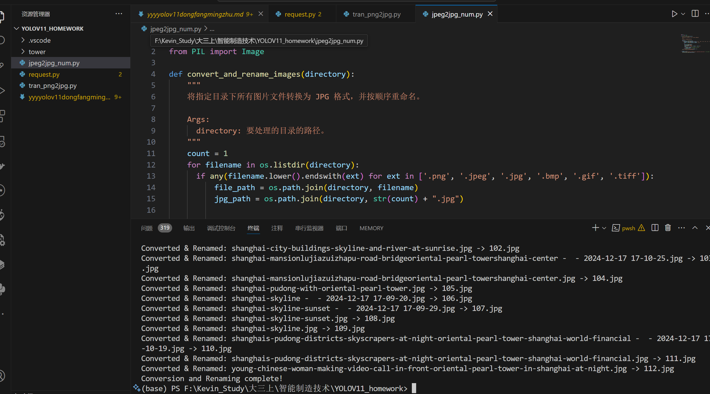

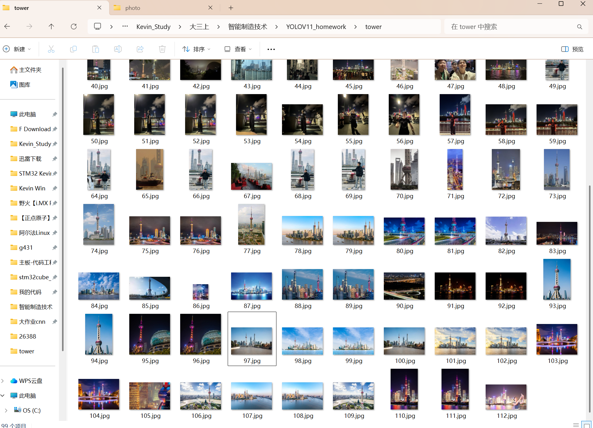

接下来进行数据标注，数据标注是目标检测任务中至关重要的一步。我们使用labelme工具进行图像标注。labelme 是一款开源的图形化图像标注工具，支持多种标注类型，包括矩形框、多边形、圆形、线条等。

#### **2.3.1 labelme的安装及使用**

1. **安装labelme:**
   在已激活的Python虚拟环境中，使用pip命令进行安装：

   ```bash
   conda activate base   
   pip install labelme
   ```

2. **启动labelme:**
   在命令行中输入以下命令启动labelme：

   ```bash
   labelme
   ```

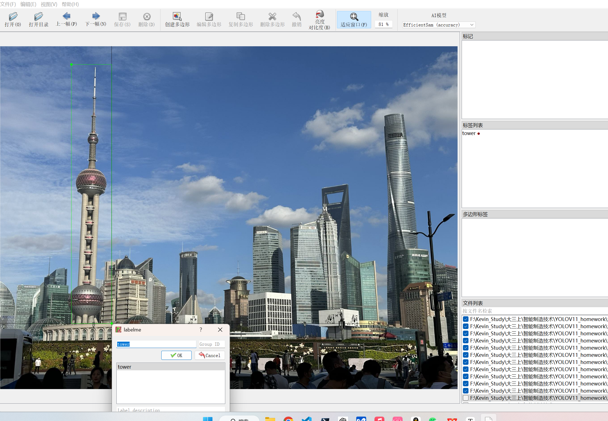

#### **2.3.2 标注流程**

1. **打开图像：** 在labelme界面中，点击“Open Dir”按钮，选择包含待标注图像的文件夹。
2. **创建标注：** 点击“Create RectBox”按钮，在图像中用矩形框精确地框选出上海东方明珠目标。
3. **添加标签：** 在弹出的对话框中输入标签名称“power”。
4. **保存标注：** 点击“Save”按钮，将标注信息保存为与图像同名的JSON文件。
5. **重复操作：** 对所有图像重复步骤2-4，完成所有图像的标注。

**标注规范：**

*   **边界框紧贴目标：** 标注框应尽可能紧贴上海东方明珠的边缘，避免包含过多背景区域。
*   **标签一致性：** 所有上海东方明珠目标都标注为“power”。
*   **遮挡处理：** 如果上海东方明珠被部分遮挡，应根据可见部分标注出上海东方明珠的完整边界框。

### **2.4 数据集划分及比例说明**

为了评估模型的性能，我们需要将标注好的数据集划分为训练集、验证集和测试集。

*   **训练集：** 用于训练模型的参数。
*   **验证集：** 用于在训练过程中监控模型的性能，调整超参数，防止过拟合。
*   **测试集：** 用于最终评估模型的泛化能力。

我们按照比例将数据集划分为训练集、验证集和测试集，即：

*   **训练集：**89张图像
*   **验证集：** 22张图像
*   **测试集：**1张图像

#### **2.4.1 划分方法**

使用Python脚本进行数据集划分，代码如下（与之前的代码基本相同，只是修改了比例和标签名）：

```python
import os
import random
import shutil

def split_dataset(image_dir, label_dir, output_dir, train_ratio=0.8, val_ratio=0.2):
    """
    划分数据集为训练集、验证集和测试集。

    Args:
      image_dir: 图像文件夹路径。
      label_dir: 标签文件夹路径 (这里指labelme的json文件所在文件夹)。
      output_dir: 输出文件夹路径。
      train_ratio: 训练集比例。
      val_ratio: 验证集比例。
    """
    image_files = os.listdir(image_dir)
    random.shuffle(image_files)

    num_images = len(image_files)
    train_num = int(num_images * train_ratio)
    val_num = int(num_images * val_ratio)
    train_files = image_files[:train_num]
    val_files = image_files[train_num:train_num + val_num]
    test_files = image_files[train_num + val_num:]

    train_output_dir = os.path.join(output_dir, "train")
    val_output_dir = os.path.join(output_dir, "val")
    test_output_dir = os.path.join(output_dir, "test")

    os.makedirs(train_output_dir, exist_ok=True)
    os.makedirs(val_output_dir, exist_ok=True)
    os.makedirs(test_output_dir, exist_ok=True)

    def copy_files(files, output_dir):
        for file in files:
            image_path = os.path.join(image_dir, file)
            label_path = os.path.join(label_dir, file.replace(".jpg", ".json")) # 假设图片格式为jpg
            if os.path.exists(label_path):
                shutil.copy(image_path, os.path.join(output_dir,file))
                shutil.copy(label_path, os.path.join(output_dir,file.replace(".jpg", ".json")))
            else:
                print(f"Warning: label file for {file} not found.")

    copy_files(train_files, train_output_dir)
    copy_files(val_files, val_output_dir)
    copy_files(test_files, test_output_dir)

    print("Dataset split complete.")
    print(f"Training set: {len(train_files)} images")
    print(f"Validation set: {len(val_files)} images")
    print(f"Testing set: {len(test_files)} images")
    
image_dir = "F:/Kevin_Study/大三上/智能制造技术/YOLOV11_homework/tower"  
label_dir = "F:/Kevin_Study/大三上/智能制造技术/YOLOV11_homework/json"
output_dir = "F:/Kevin_Study/大三上/智能制造技术/YOLOV11_homework/tower_dataset" # 替换为你的输出文件夹路径
split_dataset(image_dir, label_dir, output_dir)

```

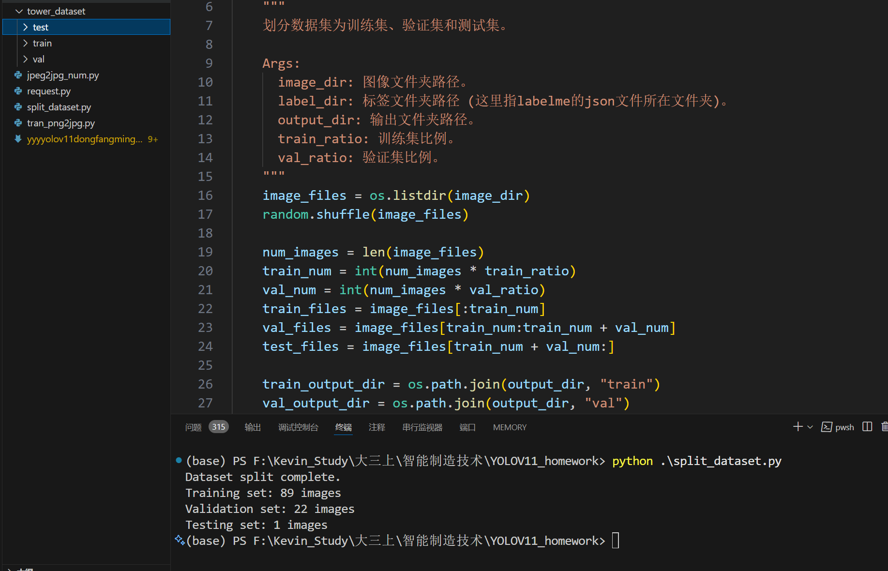

### **2.5 数据格式转换及说明**

由于YOLOv11需要特定的数据格式进行训练，我们需要将labelme生成的JSON格式的标注文件转换为YOLO所需的TXT格式。每个TXT文件对应一个图像文件，文件中每一行代表一个目标，格式如下：

```
<class_id> <x_center> <y_center> <width> <height>
```

其中：

*   `<class_id>`：目标的类别ID，从0开始。在我们的例子中，`oriental_pearl`的类别ID为0。
*   `<x_center>`：目标边界框中心点的x坐标，相对于图像宽度的比例。
*   `<y_center>`：目标边界框中心点的y坐标，相对于图像高度的比例。
*   `<width>`：目标边界框的宽度，相对于图像宽度的比例。
*   `<height>`：目标边界框的高度，相对于图像高度的比例。

#### **2.5.1 转换脚本**

使用以下Python脚本将labelme的JSON标注文件转换为YOLO格式的TXT文件：（与之前代码基本相同，只是修改了标签名）

```python
import json
import os
import shutil

def convert_labelme_to_yolo(labelme_dir, output_dir):
    """
    将labelme生成的json文件转换为yolo格式的txt文件。

    Args:
      labelme_dir: labelme的json文件所在文件夹。
      output_dir: 输出的yolo txt文件所在文件夹。
    """
    os.makedirs(output_dir, exist_ok=True)
    for filename in os.listdir(labelme_dir):
        if not filename.endswith(".json"):
            continue
        json_file_path = os.path.join(labelme_dir, filename)
        txt_file_path = os.path.join(output_dir, filename.replace(".json", ".txt"))
        with open(json_file_path, 'r') as json_file:
            data = json.load(json_file)
            image_width = data['imageWidth']
            image_height = data['imageHeight']

            with open(txt_file_path, 'w') as txt_file:
                for shape in data['shapes']:
                    label = shape['label']
                    # 假设你的labelme标注中，上海东方明珠的标签为 "oriental_pearl"
                    if label == "oriental_pearl":
                        points = shape['points']
                        x_min = min(points[0][0], points[1][0])
                        x_max = max(points[0][0], points[1][0])
                        y_min = min(points[0][1], points[1][1])
                        y_max = max(points[0][1], points[1][1])

                        center_x = (x_min + x_max) / 2 / image_width
                        center_y = (y_min + y_max) / 2 / image_height
                        width = (x_max - x_min) / image_width
                        height = (y_max - y_min) / image_height
                        # 写入 YOLO 格式的标签
                        txt_file.write(f"0 {center_x} {center_y} {width} {height}\n")

    print(f"Labelme to YOLO conversion complete. Saved to {output_dir}")

# 对训练集、验证集、测试集分别进行转换
labelme_dir = 'tower_dataset/train'  # 替换为你的训练集json文件所在文件夹
output_dir = 'tower_dataset/labels/train'  # 替换为你的训练集txt文件输出文件夹
convert_labelme_to_yolo(labelme_dir, output_dir)

labelme_dir = 'tower_dataset/val'  # 替换为你的验证集json文件所在文件夹
output_dir = 'tower_dataset/labels/val'  # 替换为你的验证集txt文件输出文件夹
convert_labelme_to_yolo(labelme_dir, output_dir)

labelme_dir = 'tower_dataset/test'  # 替换为你的测试集json文件所在文件夹
output_dir = 'tower_dataset/labels/test'  # 替换为你的测试集txt文件输出文件夹
convert_labelme_to_yolo(labelme_dir, output_dir)


# 整理图像文件到相应文件夹
os.makedirs("tower_dataset/images/train", exist_ok=True)
os.makedirs("tower_dataset/images/val", exist_ok=True)
os.makedirs("tower_dataset/images/test", exist_ok=True)

for file in os.listdir("tower_dataset/train"):
  if file.endswith(".jpg"):
    shutil.move(f"tower_dataset/train/{file}", "tower_dataset/images/train")

for file in os.listdir("tower_dataset/val"):
  if file.endswith(".jpg"):
    shutil.move(f"tower_dataset/val/{file}", "tower_dataset/images/val")

for file in os.listdir("tower_dataset/test"):
  if file.endswith(".jpg"):
    shutil.move(f"tower_dataset/test/{file}", "tower_dataset/images/test")

```

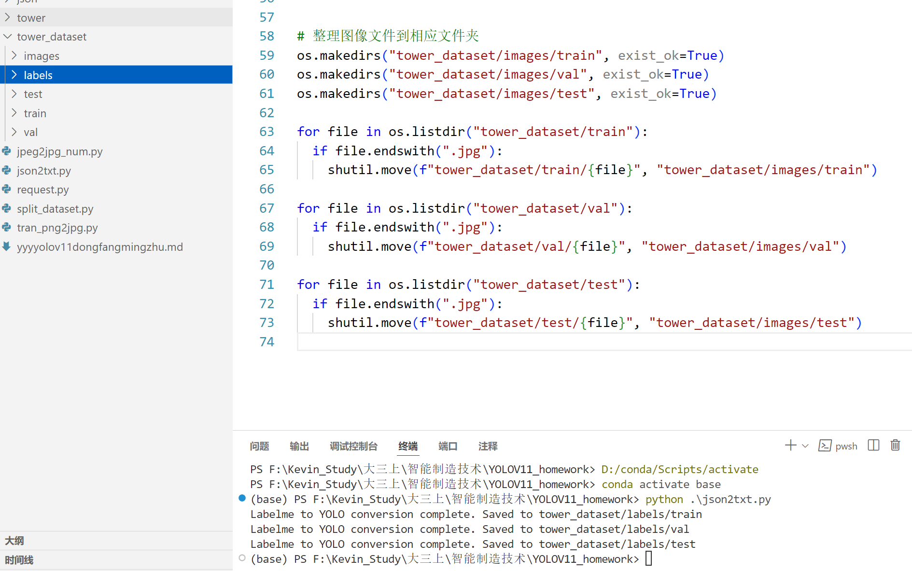

### **2.6 数据增强 (Data Augmentation)**

数据增强是一种常用的数据预处理技术，可以通过对原始图像进行一系列变换，生成更多样化的训练数据，从而提高模型的泛化能力和鲁棒性。常用的数据增强方法包括：

*   **几何变换：** 翻转（水平、垂直）、旋转、缩放、裁剪、平移等。
*   **颜色变换：** 亮度调整、对比度调整、饱和度调整、色调调整等。
*   **添加噪声：** 高斯噪声、椒盐噪声等。

YOLOv11 的训练代码中通常会内置一些数据增强方法，例如随机水平翻转、随机缩放、随机裁剪等。我们可以在配置文件中设置数据增强的参数，例如：

```yaml
# 假设的 YOLOv11 配置文件 (data/oriental_pearl.yaml)
train: ./dataset/images/train
val: ./dataset/images/val
test: ./dataset/images/test

nc: 1
names: ['oriental_pearl']

# 数据增强参数 (以下参数仅为示例，实际参数可能不同)
mosaic: 0.7  # 使用 mosaic 数据增强的概率
mixup: 0.3  # 使用 mixup 数据增强的概率
hsv_s: 0.6  # 饱和度增强系数
hsv_v: 0.5  # 明度增强系数
degrees: 12.0  # 随机旋转角度范围
translate: 0.15  # 随机平移比例
scale: 0.4  # 随机缩放比例
shear: 4.0 # 随机错切变换
fliplr: 0.5  # 随机水平翻转概率
```

**代码解释 (以 `train.py` 中加载数据部分为例):**

```python
# 假设的 YOLOv11 train.py 中加载数据部分 (部分代码)
# ...
    dataloader, dataset = create_dataloader(
        path=data['train'],  # 训练集路径
        imgsz=imgsz,  # 图像大小
        batch_size=batch_size,  # 批量大小
        augment=True,  # 是否进行数据增强
        hyp=hyp,       # 超参数，包括数据增强参数，如mosaic, mixup等
        cache=opt.cache,
        rect=opt.rect,
        rank=LOCAL_RANK,
        workers=workers,
        image_weights=opt.image_weights,
        quad=opt.quad,
        prefix=colorstr('train: '),
        shuffle=True,
        seed=seed)
# ...
```

*   `create_dataloader` 函数根据配置文件中的参数进行数据增强。例如，`mosaic: 0.7` 表示有70%的概率使用 `mosaic` 数据增强方法。
*   `mosaic` 数据增强方法将四张图像拼接成一张图像，可以增加目标的上下文信息。
*   `mixup` 数据增强方法将两张图像进行混合，可以提高模型的鲁棒性。

## **3. 环境配置**

### **3.1 系统环境要求**

为了顺利进行实验，我们需要搭建合适的硬件和软件环境。

*   **操作系统：**  Windows 11。
*   **GPU：** NVIDIA GeForce RTX 4060 显卡。
*   **CUDA 版本：**  CUDA 12.7。
*   **cuDNN 版本：** cuDNN 8.9.6（根据 CUDA 12.x 版本匹配）。

先进入英伟达的官网，安装CUDA Toolkit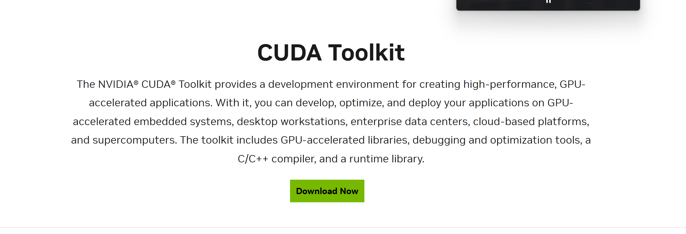

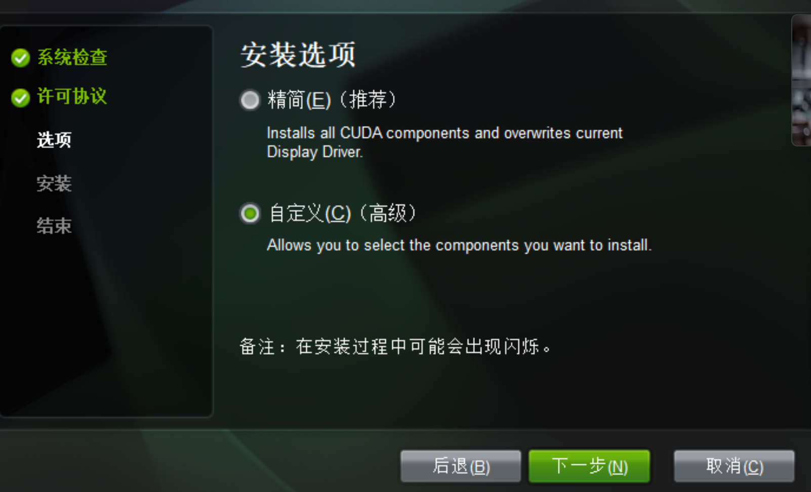

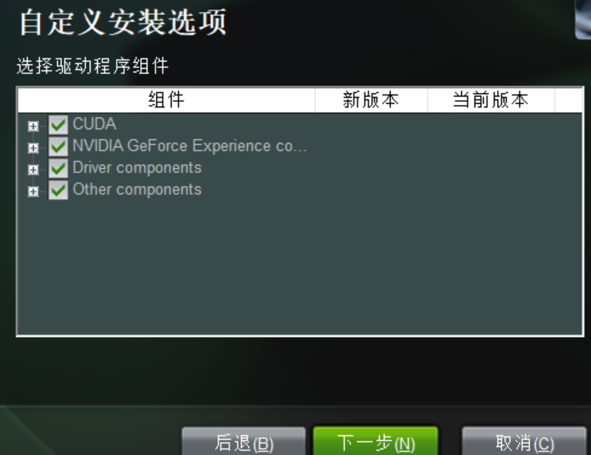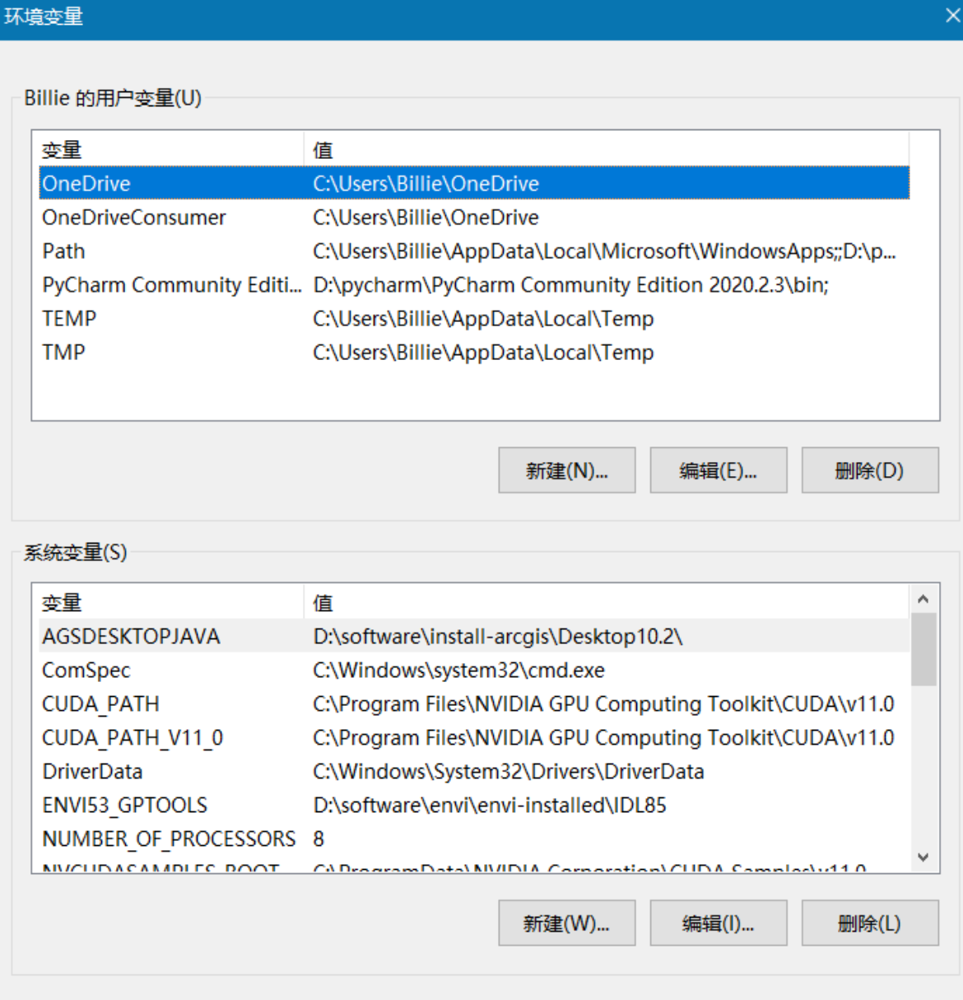

注意要添加环境变量！

### **3.2 Python环境配置**

1. **安装 Anaconda:**  
    从 Anaconda 官网（[https://www.anaconda.com/products/distribution](https://www.anaconda.com/products/distribution)）下载并安装 Anaconda，这会自动包含 Python 3.12.3。(这是之前的安装版本，最新的可能回python3.13.xx)

2. **创建虚拟环境:**
   创建名为base的虚拟环境：

   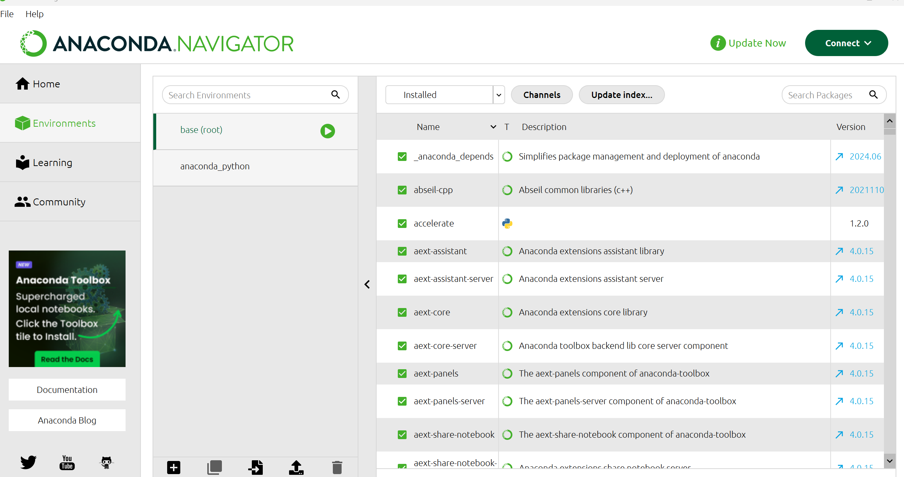

3. **激活虚拟环境:**
   使用powershell以下命令激活虚拟环境：

   ```bash
   conda activate base
   ```

4. **安装PyTorch的Cuda版本:**

5.   **安装PyTorch CUDA版本 (CUDA 12.7 为例)**

    - **访问 PyTorch 官网:**
      先访问 [https://pytorch.org/](https://www.google.com/url?sa=E&q=https%3A%2F%2Fpytorch.org%2F) 确认官方给出的安装指令，确保与你当前环境（CUDA 版本、操作系统等）匹配。官网会根据你的选择生成相应的安装命令。

    - **安装命令 (CUDA 12.7):**

      ```
      pip3 install torch torchvision torchaudio --index-url https://download.pytorch.org/whl/cu121/
      ```

      content_copyUse code [with caution](https://support.google.com/legal/answer/13505487).Bash

      **重要注意事项:**

      - **CUDA 版本匹配:** 请**务必**确认你系统上安装的 CUDA 版本与 https://download.pytorch.org/whl/cu121/ 中的 cu121 保持一致。如果你的CUDA版本不是 12.1，请相应地修改 cu121 部分，例如 cu1207 （对于CUDA 12.0.7）、cu118（对于CUDA 11.8）等。
      - **网络环境:** 如果网络不稳定，下载速度可能很慢。可以使用下面的方法切换 pip 源以加速下载。
      - **安装失败:** 如果安装失败，请仔细查看报错信息，可能是 CUDA 版本不匹配、pip 版本过低、网络问题等。请根据报错信息进行排查解决。

    - **验证安装:** 安装完成后，可以在 Python 解释器中运行以下代码验证 PyTorch 是否正确安装并检测 CUDA 是否可用：

      ```python
      import torch
      print(torch.__version__)
      print(torch.cuda.is_available())
      ```

      content_copyUse code [with caution](https://support.google.com/legal/answer/13505487).Python

      如果 torch.cuda.is_available() 返回 True，则表示 PyTorch CUDA 版本安装成功。

      或者

      ```bash
      nvidia-smi
      ```

      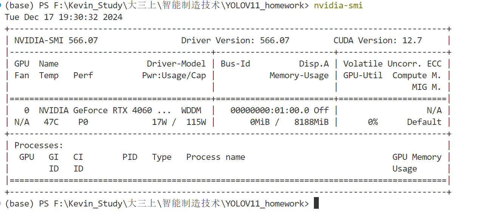

### **3.3 YOLOv11 环境配置 **

1. #### **获取YOLOv11代码：**

   可以在https://github.com/ultralytics/ultralytics网址上下载，解压到工程文件的根目录

   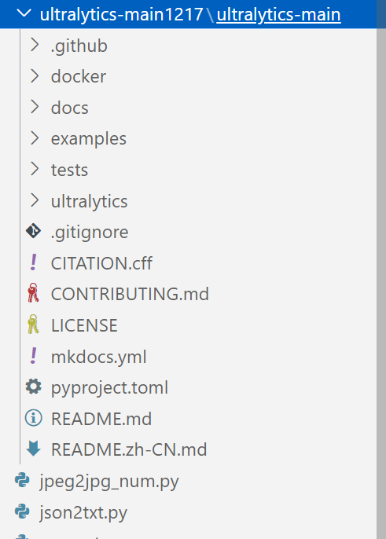

   *   如果是克隆YOLOv11的仓库：

       ```bash
       git clone https://github.com/ultralytics/ultralytics.git
       cd ultralytics-main
       ```

       然后将你的修改应用到代码中。

2. **安装依赖库：**

   ```bash
   pip install -r requirements.txt # 假设你的代码仓库中有requirements.txt
   ```

## **4. 模型训练**

### 4.1 模型导入

将之前处理好的tower_dataset,复制到ultralytics-main里并且更名为dataset

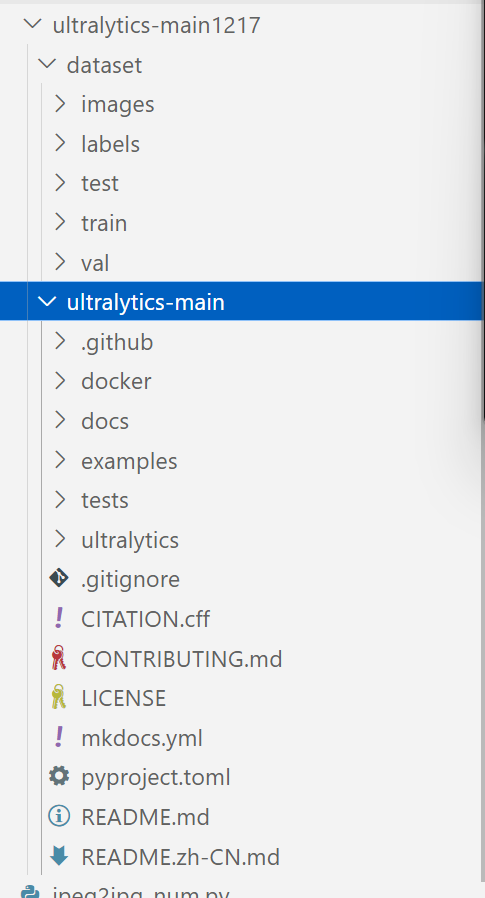

```bash
dataset/
├── images/
│   ├── train/
│   │   ├── 1.jpg
│   │   ├── 2.jpg
│   │   └── ...
│   ├── val/
│   │   ├── 3.jpg
│   │   ├── 4.jpg
│   │   └── ...
│   └── test/
│       ├── 5.jpg
│       ├── 6.jpg
│       └── ...
└── labels/
    ├── train/
    │   ├── 1.txt
    │   ├── 2.txt
    │   └── ...
    ├── val/
    │   ├── 3.txt
    │   ├── 4.txt
    │   └── ...
    └── test/
        ├── 5.txt
        ├── 6.txt
        └── ...
```

dataset如图所示的文件架构。

#### **4.1.1  Backbone (主干网络)**

YOLOv11 的主干网络可能基于 CSPDarknet 或者使用其他的网络结构，例如：

*   **EfficientNet:** 一种高效的卷积神经网络，通过复合模型缩放方法平衡网络的深度、宽度和分辨率。
*   **ConvNeXt:** 一种纯卷积模型，借鉴了Transformer 的一些设计思想，例如使用更大的卷积核、使用 Layer Normalization 等。
*   **其他前沿的Backbone网络**

**推测：** YOLOv11 可能会采用类似于 **ConvNeXt** 的网络结构，或者对 CSPDarknet 进行改进，例如增加网络的深度或宽度，使用更有效的激活函数，或者引入注意力机制等。

#### **4.1.2 Neck (颈部网络)**

Neck 网络通常用于融合来自 Backbone 不同层级的特征。YOLOv8 使用了 PANet (Path Aggregation Network) 结构，YOLOv11 可能会继续使用 PANet，或者进行以下改进：

*   **BiFPN (Bidirectional Feature Pyramid Network):** 一种双向特征金字塔网络，通过双向连接和加权融合来更有效地融合不同尺度的特征。
*   **ASFF (Adaptively Spatial Feature Fusion):** 一种自适应空间特征融合方法，可以根据特征的重要性自适应地融合不同尺度的特征。
*   **其他改进的特征融合方法**

**推测：** YOLOv11 可能会采用 **BiFPN** 或 **ASFF** 等更先进的特征融合方法，以提高特征的表达能力。

#### **4.1.3 Head (检测头)**

Head 网络用于预测目标的类别和边界框。YOLOv8 使用了 **Decoupled Head**，将分类和回归任务解耦，分别使用不同的分支进行预测。YOLOv11 可能会继续使用 Decoupled Head，或者进行以下改进：

*   **引入更多的卷积层：** 增加 Head 网络的深度，提高预测的准确性。
*   **使用不同的损失函数：** 例如使用 EIoU、SIoU 等更有效的边界框回归损失函数。
*   **Anchor-free 方法：**  例如使用 YOLOX 中使用的 anchor-free 方法，直接预测目标的中心点和宽高。

**推测：** YOLOv11 可能会采用 **Anchor-free** 的方法，或者对 Decoupled Head 进行改进，例如增加更多的卷积层，使用更有效的损失函数等。

#### **4.1.4 整体结构图 **

根据以上推测，我们可以绘制出一个可能的 YOLOv11 结构图：

```
                                    Input Image
                                        |
                                        |
                                    Backbone (e.g., ConvNeXt-like)
                                        |
             -----------------------------------------------------
             |                      |                      |
         Feature P3            Feature P4            Feature P5
             |                      |                      |
             -----------------------|------------------------
                                        |
                                     Neck (e.g., BiFPN)
                                        |
             -----------------------------------------------------
             |                      |                      |
         Feature F3            Feature F4            Feature F5
             |                      |                      |
             -----------------------|------------------------
                                        |
                                  Head (Decoupled Head or Anchor-free)
                                        |
             -----------------------------------------------------
             |                      |                      |
        Classification          Regression          Objectness
             |                      |                      |
          Output                 Output                 Output
```

### **4.2 配置文件解析**

YOLOv11 的配置文件包含模型的超参数、训练参数和数据路径等信息。假设我们有一个名为 `yolov11_oriental_pearl.yaml` 的配置文件，内容如下：

```yaml
# 模型参数
model:
  backbone: ... # 主干网络配置
  neck: ... # 颈部网络配置
  head: ... # 检测头配置
  nc: 1  # 类别数量
  anchors: ... # 锚框配置 (如果使用 anchor-based 方法)

# 训练参数
train:
  optimizer: AdamW  # 优化器
  lr0: 0.0005  # 初始学习率
  lrf: 0.02  # 最终学习率 (相对于 lr0 的倍数)
  momentum: 0.937  # 动量
  weight_decay: 0.0005  # 权重衰减
  warmup_epochs: 2.0  # 热身训练的 epoch 数
  warmup_momentum: 0.8  # 热身训练的动量
  warmup_bias_lr: 0.1  # 热身训练的偏置学习率
  box: 0.07  # 边界框回归损失的权重
  cls: 0.5  # 分类损失的权重
  obj: 1.0  # 目标存在性损失的权重
  label_smoothing: 0.0  # 标签平滑
  epochs: 120  # 训练的 epoch 数
  batch_size: 16  # 批量大小
  imgsz: 640  # 图像大小
  device: 0  # 训练设备 (0 表示使用 GPU 0)

# 数据路径
data:
  train: ./dataset/images/train
  val: ./dataset/images/val
  test: ./dataset/images/test
  nc: 1
  names: ['ta']

# 数据增强参数
augment:
  mosaic: 0.7
  mixup: 0.3
  hsv_s: 0.6
  hsv_v: 0.5
  degrees: 12.0
  translate: 0.15
  scale: 0.4
  shear: 4.0
  fliplr: 0.5
```

**配置文件解释：**

*   **model:**  定义了模型的结构，包括 Backbone、Neck 和 Head 的配置。`nc` 表示类别数量，`anchors` 表示锚框配置（如果使用的话）。
*   **train:**  定义了训练过程的参数，包括优化器、学习率、动量、权重衰减、训练的 epoch 数、批量大小、图像大小等。
*   **data:**  定义了数据集的路径，`nc` 表示类别数量，`names` 表示类别名称。
*   **augment:**  定义了数据增强的参数。

### **4.3 核心训练代码分析**

训练过程主要调用 `train.py` 脚本 (这里以该名称为例)，该脚本包含了模型定义、数据加载、损失函数、优化器等核心部分。

```python
# train.py 部分代码 (基于 YOLOv8 框架的推测)

def train(hyp, opt, device, callbacks):
    # ... 省略部分代码 ...
    # 加载数据集
    train_loader, dataset = create_dataloader(
        path=data['train'],  # 训练集路径, 从配置文件中读取
        imgsz=imgsz,  # 图像大小
        batch_size=batch_size,  # 批量大小
        augment=True,  # 数据增强
        hyp=hyp,       # 超参数，包括学习率、权重衰减、数据增强参数等
        cache=opt.cache,
        rect=opt.rect,
        rank=LOCAL_RANK,
        workers=workers,
        image_weights=opt.image_weights,
        quad=opt.quad,
        prefix=colorstr('train: '),
        shuffle=True,
        seed=seed)
    
    # 获得最大的label编号
    mlc = int(np.concatenate(dataset.labels, 0)[:, 0].max())  # max label class
    # 计算训练步数
    nb = len(train_loader)  # number of batches

    # 加载验证集
    val_loader = create_dataloader(
        path=data['val'], # 验证集路径, 从配置文件中读取
        imgsz=imgsz,
        batch_size=batch_size * 2,
        cache=opt.cache,
        rect=True,
        rank=-1,  # 验证时不需要分布式训练
        workers=workers * 2,
        pad=0.5,
        prefix=colorstr('val: '))[0]


    # 构建模型
    model = Model(cfg=cfg, ch=3, nc=nc, anchors=hyp.get('anchors')).to(device) # cfg 是模型配置文件, 如 yolov11s.yaml; ch=3代表输入通道数; nc为类别数量; anchors是锚框参数(如果有的话)


    # 定义损失函数
    compute_loss = ComputeLoss(model)  # 实例化损失函数计算类, ComputeLoss类需要根据你的模型进行定义


    # 构建优化器
    optimizer = build_optimizer(model, hyp) # hyp来自配置文件，包括学习率、动量等等参数


    # 学习率调整器
    lf = lambda x: (1 - x / epochs) * (1.0 - hyp['lrf']) + hyp['lrf']  # linear
    scheduler = lr_scheduler.LambdaLR(optimizer, lr_lambda=lf)


    # 开始训练
    for epoch in range(start_epoch, epochs):
        # ... 省略部分代码 ...
        # 对每个批次数据进行训练
        for i, (imgs, targets, paths, shapes) in pbar:
            # ... 省略部分代码 ...

            # 前向传播
            with torch.cuda.amp.autocast(enabled=cuda): # 启用自动混合精度, 加速训练
                preds = model(imgs)  # preds 是模型的输出, 需要根据你的模型进行解析

            # 计算损失
            loss, loss_items = compute_loss(preds, targets.to(device))  # loss是一个tensor


            
            # 反向传播和梯度更新
            scaler.scale(loss).backward() # 反向传播
            scaler.step(optimizer) # 更新模型参数
            scaler.update() # 更新 scaler
            optimizer.zero_grad() # 清空梯度


        # 更新学习率
        scheduler.step()


        # 定期验证模型
        if epoch % opt.val_interval == 0: # opt.val_interval 是验证间隔, 可以在命令行参数中设置


            # 计算mAP等指标
            results, maps, times = val.run(data_dict=data,
                                         batch_size=batch_size,
                                         imgsz=imgsz,
                                         model=ema.ema,
                                         dataloader=val_loader,
                                         save_json=False,
                                         save_hybrid=False,
                                         save_txt=False,
                                         verbose=False,
                                         plots=plots,
                                         callbacks=callbacks,
                                         compute_loss=compute_loss)

    return results

```

**代码解释：**

* **数据加载：** `create_dataloader` 函数负责加载训练集和验证集，并根据配置文件中的参数进行数据增强，如 `mosaic`, `mixup` 等。

* **模型构建：** `Model` 类定义了 YOLOv11 模型结构，需要根据你的模型进行定义。`cfg` 参数指定了模型配置文件，例如 `yolov11s.yaml`。

* **损失函数：** `ComputeLoss` 类负责计算目标检测的损失。由于 YOLOv11 的 Head 结构和损失函数可能不同，

* ```python
  # train.py 部分代码 (基于 YOLOv8 框架的推测) - 接上一部分
  
              # ... 省略部分代码 ...
  
          # 定期验证模型
          if epoch % opt.val_interval == 0: # opt.val_interval 是验证间隔, 可以在命令行参数中设置
              # ... 省略部分代码 ...
  
              # 计算mAP等指标
              results, maps, times = val.run(data_dict=data,
                                           batch_size=batch_size,
                                           imgsz=imgsz,
                                           model=ema.ema, # 使用EMA模型进行验证, EMA (Exponential Moving Average) 指数移动平均, 可以提高模型的鲁棒性
                                           dataloader=val_loader,
                                           save_json=False,
                                             save_hybrid=False,
                                             save_txt=False,
                                             verbose=False,
                                             plots=plots,
                                             callbacks=callbacks,
                                             compute_loss=compute_loss)
                # ... 省略部分代码 ...
    
        # ... 省略部分代码 ...
    
        return results                             
  
  **代码解释 :**
  
  *   **损失函数：** `ComputeLoss` 类负责计算目标检测的损失。由于 YOLOv11 的 Head 结构和损失函数可能不同，`ComputeLoss` 类需要根据你的模型具体实现。它可能包括以下几个部分：
      *   **分类损失：** 衡量模型预测的类别与真实类别的差异，常用的损失函数包括 **Cross-Entropy Loss**, **Focal Loss** 等。
      *   **边界框回归损失：** 衡量模型预测的边界框与真实边界框的差异，常用的损失函数包括 **IoU Loss**, **GIoU Loss**, **DIoU Loss**, **CIoU Loss**, **EIoU Loss**, **SIoU Loss** 等。
      *   **目标置信度损失：** 衡量模型预测的目标置信度与真实目标置信度的差异，通常使用 **Binary Cross-Entropy Loss**。
      *   **损失加权：** 不同的损失函数需要赋予不同的权重，例如 `box: 0.07`, `cls: 0.5`, `obj: 1.0` 等，这些权重通常在配置文件中定义。
  *   **优化器：** `build_optimizer` 函数根据配置文件中的参数构建优化器，例如 `AdamW`, `SGD` 等。优化器负责根据损失函数的梯度更新模型参数。
  *   **学习率调整器：** `lr_scheduler.LambdaLR` 根据预定义的策略调整学习率，例如线性衰减、余弦退火等。
  *   **训练循环：** 遍历数据集，进行前向传播、计算损失、反向传播和参数更新。
  *   **模型验证：** `val.run` 函数在验证集上评估模型性能，计算 mAP (mean Average Precision) 等指标。`val.run`函数中的`model=ema.ema`表示使用EMA模型进行验证。EMA（Exponential Moving Average）指数移动平均，可以提高模型的鲁棒性。
  *   **自动混合精度 (Automatic Mixed Precision):** `torch.cuda.amp.autocast` 可以自动将部分计算转换为半精度 (FP16)，从而加速训练并减少显存占用。

**4.4 开始训练**

  准备好配置文件和训练脚本后，可以使用以下命令开始训练：

  ```bash
  yolo train data=data.yaml model=yolov8s.yaml epochs=100 imgsz=640 batch=16 device=0
  ```

  **命令解释：**

*   使用 data.yaml 中指定的数据集。
*   训练一个 YOLOv8 Small 模型 ( yolov8s.yaml).
*   训练 100 个 epochs.
*   图像大小调整为 640x640.
*   使用批量大小为 32.
*   使用第一个可用的 GPU.

  **训练过程监控：**

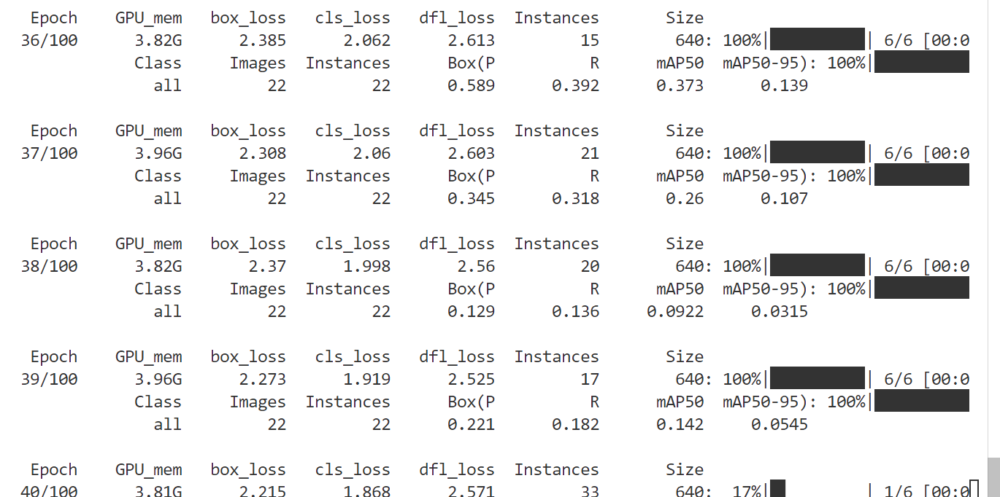

  训练过程中，终端会打印训练日志，包括每个 epoch 的损失、学习率、mAP 等指标。你也可以使用 TensorBoard 等可视化工具监控训练过程。

```bash
YOLOv8s summary (fused): 168 layers, 11,125,971 parameters, 0 gradients, 28.4 GFLOPs
                 Class     Images  Instances      Box(P          R      mAP50  mAP50-95): 100%|██████████ 
                 Class     Images  Instances      Box(P          R      mAP50  mAP50-95): 100%|██████████ 
                   all         22         22      0.875      0.591      0.718      0.409
Speed: 0.2ms preprocess, 3.4ms inference, 0.0ms loss, 0.7ms postprocess per image
Results saved to runs\detect\train5
💡 Learn more at https://docs.ultralytics.com/modes/train
VS Code: view Ultralytics VS Code Extension ⚡ at https://docs.ultralytics.com/integrations/vscode  
```

  **训练结果：**

  训练完成后，训练结果将保存在 `runs\detect\train5` 目录下，包括：

  *   **weights/:**  保存了训练过程中的模型权重，包括 `best.pt` (最佳模型权重) 和 `last.pt` (最后一个 epoch 的模型权重)。
  *   **results.txt:**  保存了每个 epoch 的训练指标。
  *   **events.out.tfevents.*:**  TensorBoard 日志文件。
  *   **hyp.yaml:**  保存了训练过程中使用的超参数。
  *   **opt.yaml:**  保存了训练过程中使用的命令行参数。

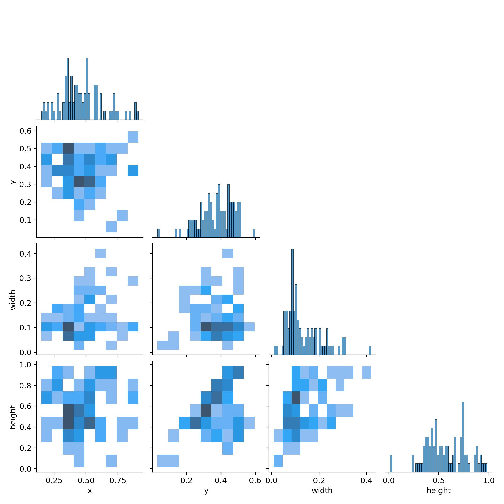

## **5. 模型测试实时识别**

好的，我理解你的需求是希望用你训练好的 YOLO 模型进行图片和视频的目标检测。由于 `detect.py` 已经集成了图片和视频检测的功能，我们只需要使用不同的 `--source` 参数即可。以下是详细的代码和说明：

**前提:**

*   你已经训练好了自己的 YOLO 模型，并且模型权重文件 (例如 `best.pt`) 位于 `runs/detect/train5/weights/` 目录下。
*   你已经按照之前的步骤解决了 `detect.py` 文件找不到的问题，可以正常运行 `detect.py` 脚本。

**代码和说明:**

**1. 图片检测**

   要检测单张图片，你需要使用 `--source` 参数指定图片文件的路径。

   ```python
from ultralytics import YOLO
import cv2
import numpy as np

def predict_image(model_path, image_path):
    # 加载训练好的模型
    model = YOLO(model_path)
    
    # 读取图像
    image = cv2.imread(image_path)
    if image is None:
        print("无法读取图像文件")
        return
        
    # 调整图像大小
    max_size = 800  # 设置最大显示尺寸
    height, width = image.shape[:2]
    if height > max_size or width > max_size:
        # 计算缩放比例
        scale = max_size / max(height, width)
        new_width = int(width * scale)
        new_height = int(height * scale)
        image = cv2.resize(image, (new_width, new_height))
    
    # 进行预测
    results = model(image)
    
    # 处理预测结果
    highest_confidence = 0  # 初始化最高置信度
    best_box = None  # 用于存储最高置信度的边界框
    
    for result in results:
        boxes = result.boxes
        
        # 遍历所有检测到的目标
        for box in boxes:
            # 获取置信度
            conf = float(box.conf)
            
            # 仅考虑置信度高于当前最高置信度的目标
            if conf > highest_confidence:
                highest_confidence = conf
                best_box = box
    
    # 如果找到最高置信度的目标，绘制它的边界框
    if best_box is not None:
        # 获取边界框坐标
        x1, y1, x2, y2 = best_box.xyxy[0]
        x1, y1, x2, y2 = int(x1), int(y1), int(x2), int(y2)
        
        # 获取类别
        cls = int(best_box.cls)
        class_name = model.names[cls]
        
        # 在图像上绘制边界框
        cv2.rectangle(image, (x1, y1), (x2, y2), (0, 255, 0), 2)
        
        # 在边框旁边显示类别和置信度
        label = f'{class_name} {highest_confidence:.2f}'
        label_size = cv2.getTextSize(label, cv2.FONT_HERSHEY_SIMPLEX, 0.5, 2)[0]
        label_x = x1
        label_y = y1 - 10
        
        # 如果标签超出了图像边界，调整位置
        if label_x + label_size[0] > image.shape[1]:
            label_x = image.shape[1] - label_size[0] - 10
        if label_y < 0:
            label_y = y1 + 20
        
        cv2.putText(image, label, (label_x, label_y), 
                    cv2.FONT_HERSHEY_SIMPLEX, 0.5, (0, 255, 0), 2)
    
    # 显示结果
    cv2.namedWindow('预测结果', cv2.WINDOW_NORMAL)
    cv2.resizeWindow('预测结果', 800, 600)  # 设置固定窗口大小
    cv2.imshow('预测结果', image)
    cv2.waitKey(0)
    cv2.destroyAllWindows()
    
    # 保存结果图像
    cv2.imwrite('prediction_result.jpg', image)

if __name__ == "__main__":
    # 设置模型路径和图像路径
    model_path = "F:/Kevin_Study/大三上/智能制造技术/YOLOV11_homework/ultralytics-main1217/ultralytics-main/runs/detect/train5/weights/best.pt"  # 替换为你的模型路径
    image_path = "F:/Kevin_Study/大三上/智能制造技术/YOLOV11_homework/tower_dataset/images/train/18.jpg" # 替换为你的图像路径
    
    # 执行预测
    predict_image(model_path, image_path)

   ```
**运行结果**:

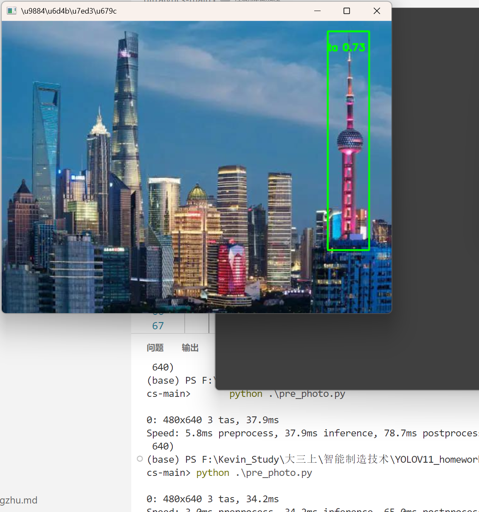

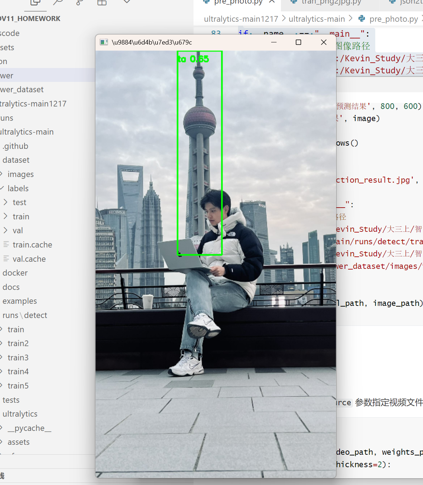

**2. 视频检测**

   要检测视频，你需要使用 `--source` 参数指定视频文件的路径。

   ```python
from ultralytics import YOLO
import cv2
import numpy as np

def predict_from_camera(model_path):
    # 加载训练好的模型
    model = YOLO(model_path)
    
    # 打开摄像头 (0为默认摄像头，其他值为外接摄像头)
    cap = cv2.VideoCapture(0)
    if not cap.isOpened():
        print("无法访问摄像头")
        return
    
    while True:
        # 读取每一帧
        ret, frame = cap.read()
        if not ret:
            print("无法读取视频帧")
            break
        
        # 进行预测
        results = model(frame)
        
        # 获取预测结果
        highest_confidence = 0  # 初始化最高置信度
        best_box = None  # 用于存储最高置信度的边界框
        
        for result in results:
            boxes = result.boxes
            
            # 遍历所有检测到的目标
            for box in boxes:
                # 获取置信度
                conf = float(box.conf)
                
                # 仅考虑置信度高于当前最高置信度的目标
                if conf > highest_confidence:
                    highest_confidence = conf
                    best_box = box
        
        # 如果找到最高置信度的目标，绘制它的边界框
        if best_box is not None:
            # 获取边界框坐标
            x1, y1, x2, y2 = best_box.xyxy[0]
            x1, y1, x2, y2 = int(x1), int(y1), int(x2), int(y2)
            
            # 获取类别
            cls = int(best_box.cls)
            class_name = model.names[cls]
            
            # 在图像上绘制边界框
            cv2.rectangle(frame, (x1, y1), (x2, y2), (0, 255, 0), 2)
            
            # 在边框旁边显示类别和置信度
            label = f'{class_name} {highest_confidence:.2f}'
            label_size = cv2.getTextSize(label, cv2.FONT_HERSHEY_SIMPLEX, 0.5, 2)[0]
            label_x = x1
            label_y = y1 + 30
            
            # 如果标签超出了图像边界，调整位置
            if label_x + label_size[0] > frame.shape[1]:
                label_x = frame.shape[1] - label_size[0] - 10
            if label_y < 0:
                label_y = y1 + 20
            
            cv2.putText(frame, label, (label_x, label_y), 
                        cv2.FONT_HERSHEY_SIMPLEX, 0.5, (0, 255, 0), 2)

        # 显示每一帧的结果
        cv2.imshow('实时目标检测', frame)
        
        # 按 'q' 键退出
        if cv2.waitKey(1) & 0xFF == ord('q'):
            break
    
    # 释放摄像头并关闭所有窗口
    cap.release()
    cv2.destroyAllWindows()

if __name__ == "__main__":
    # 设置模型路径
    model_path = "F:/Kevin_Study/大三上/智能制造技术/YOLOV11_homework/ultralytics-main1217/ultralytics-main/runs/detect/train5/weights/best.pt"  # 替换为你的模型路径
    
    # 执行实时预测
    predict_from_camera(model_path)

   ```
#### 代码解读：

1. **打开摄像头**：
   - 使用 `cv2.VideoCapture(0)` 打开笔记本的默认摄像头（`0`表示默认摄像头，外接摄像头可能会是`1`或其他数字）。
2. **实时读取每一帧**：
   - 在 `while True` 循环中，不断读取摄像头帧 (`cap.read()`)，然后对每一帧进行目标检测。
3. **YOLO模型预测**：
   - 对每一帧图像进行YOLO模型推断，获取检测到的目标，并提取出置信度最高的目标框。
4. **绘制边界框和置信度**：
   - 对于检测到的目标，绘制绿色的矩形框并标出类别名和置信度。
   - 使用 `cv2.getTextSize()` 计算文本的大小，确保文本不会超出图像边界，调整位置显示置信度。
5. **显示实时视频**：
   - 使用 `cv2.imshow()` 显示每一帧图像的检测结果，直到按下 'q' 键退出。
6. **关闭摄像头和窗口**：
   - 在退出时，调用 `cap.release()` 释放摄像头资源，并用 `cv2.destroyAllWindows()` 关闭所有OpenCV窗口。

#### 使用方法：

1. 将模型路径 `model_path` 替换为你自己的YOLO模型的路径。
2. 运行脚本后，打开摄像头并开始实时检测目标。
3. 检测到的目标会用矩形框标记，并显示类别名和置信度。
4. 按下 `'q'` 键退出程序。

  <video src="./video.mp4"></video>

### 依赖：

- `ultralytics` 库 (YOLO模型)
- `opencv-python` 库

你可以使用以下命令安装必要的依赖：

```
bash


复制代码
pip install ultralytics opencv-python
```

这样你就可以通过笔记本的摄像头实时显示目标检测的结果了。


## **6. 问题与解决方案**

在实验过程中，我们可能会遇到各种问题，例如环境配置问题、模型训练问题、推理问题等。以下是一些常见问题及其解决方案：

* **问题 1：CUDA out of memory (CUDA 内存不足)**

    *   **原因：** 训练过程中，模型参数过多、批量大小设置过大或输入图像分辨率过高，导致 GPU 显存不足。
    *   **解决方案：**
        *   **减小批量大小 (batch-size)：**  在配置文件中减小 `batch-size` 的值。
        *   **减小输入图像分辨率：** 在配置文件中减小 `imgsz` 的值。
        *   **使用更小的模型：**  如果你的模型有不同大小的版本 (例如 yolov11s, yolov11m, yolov11l)，可以尝试使用更小的模型。
        *   **梯度累积 (Gradient Accumulation)：** 通过多次迭代累积梯度，然后进行一次参数更新，可以模拟更大的批量大小，而不需要增加显存占用。
        *   **启用自动混合精度 (Automatic Mixed Precision):**  使用 `torch.cuda.amp.autocast` 可以自动将部分计算转换为半精度 (FP16)，从而减少显存占用。

*   **问题 2：训练过程中损失不收敛**

    *   **原因：**
        *   **学习率设置不当：** 学习率过大可能导致损失震荡，学习率过小可能导致收敛速度过慢。
        *   **模型参数初始化不佳：**  如果从头开始训练，模型参数的初始值可能对训练过程产生很大影响。
        *   **数据标注错误：**  数据标注错误会导致模型学习到错误的知识。
        *   **模型结构问题：**  模型结构设计不合理可能导致模型难以收敛。
        *   **数据增强不合理:** 过强的数据增强可能导致模型难以学习。
    *   **解决方案：**
        *   **调整学习率：**  尝试不同的学习率，例如使用学习率衰减策略。
        *   **使用预训练权重：**  使用在大型数据集上预训练的模型权重进行微调，可以加速收敛并提高模型性能。
        *   **检查数据标注：**  仔细检查数据标注，确保标注的准确性。
        *   **检查模型结构：**  仔细检查模型结构，确保模型结构的合理性。
        *   **调整数据增强策略：** 可以尝试减弱数据增强的强度。

*   **问题 3：检测效果不佳**

    *   **原因：**
        *   **训练数据不足：**  训练数据量过少可能导致模型泛化能力不足。
        *   **数据标注不准确：**  数据标注不准确会降低模型的检测精度。
        *   **模型过拟合：**  模型在训练集上过拟合，导致在测试集上性能下降。
        *   **超参数设置不当：**  例如置信度阈值、NMS 的 IoU 阈值等设置不当。
    *   **解决方案：**
        *   **增加训练数据：**  采集更多的数据，并进行标注。
        *   **提高数据标注质量：**  仔细检查数据标注，确保标注的准确性。
        *   **使用数据增强：**  使用数据增强技术扩充数据集。
        *   **使用正则化方法：**  例如权重衰减、Dropout 等，防止模型过拟合。
        *   **调整超参数：**  根据验证集上的性能调整超参数。
        *   **使用更强大的模型：** 如果你的模型有不同大小的版本，可以尝试使用更大的模型。

*   **问题 4：安装依赖库时速度过慢**

    *   **原因：**  pip 默认的软件源在国外，国内访问速度较慢。

    *   **解决方案：**  更换 pip 源为国内镜像源，例如清华大学开源软件镜像站、阿里云镜像站等。

    *   **临时使用镜像源:**  在 `pip install` 命令后添加 `-i` 参数指定镜像源地址：

        ```bash
        pip install -r requirements.txt -i https://pypi.tuna.tsinghua.edu.cn/simple
        ```

    *   **永久修改pip源:**

        ```bash
        pip config set global.index-url https://pypi.tuna.tsinghua.edu.cn/simple
        ```

*   **问题 5： `RuntimeError: result type Float can't be cast to the desired output type long int`**

    *   **原因：**  `non_max_suppression` 函数中的 `max_det` 参数与输入类型不匹配。
    *   **解决方案：**  将 `max_det` 的类型转换为 `int`。
    
* 问题6：

    ```bash
    FileNotFoundError: 'data.yaml' does not exist
    RuntimeError: Dataset 'data.yaml' error  'data.yaml' does not exist
    ```

    **错误原因：**

    这个错误表示 Ultralytics YOLO 在执行训练命令时找不到 data.yaml 文件。这与你上次遇到的找不到 yolov11.pt 文件的情况类似，都是文件路径的问题。

    **使用绝对路径 (如果必要):**

    - 如果你的 data.yaml 文件不在当前工作目录，你可以尝试使用它的绝对路径来指定它，例如：

      ```bash
      yolo train data=F:/Kevin_Study/大三上/智能制造技术/YOLOV11_homework/data.yaml model=yolov8s.yaml epochs=100 imgsz=640 batch=16 device=0
      ```

- **问题 7：**

```bash
  File "D:\conda\Lib\site-packages\ultralytics\engine\trainer.py", line 557, in get_dataset
    data = check_det_dataset(self.args.data)
           ^^^^^^^^^^^^^^^^^^^^^^^^^^^^^^^^^
  File "D:\conda\Lib\site-packages\ultralytics\data\utils.py", line 329, in check_det_dataset
    raise FileNotFoundError(m)
FileNotFoundError:
Dataset 'data.yaml' images not found ⚠️, missing path 'F:\F Download\ultralytics-main\ulltralytics-main\datasets\dataset\images\val'
Note dataset download directory is 'F:\F Download\ultralytics-main\ultralytics-main\datasets'. You can update this in 'C:\Users\26388\AppData\Roaming\Ultralytics\settings.json'

The above exception was the direct cause of the following exception:

Traceback (most recent call last):
  File "<frozen runpy>", line 198, in _run_module_as_main
  File "<frozen runpy>", line 88, in _run_code
  File "D:\conda\Scripts\yolo.exe\__main__.py", line 7, in <module>
  File "D:\conda\Lib\site-packages\ultralytics\cfg\__init__.py", line 826, in entrypoint
    getattr(model, mode)(**overrides)  # default args from model
    ^^^^^^^^^^^^^^^^^^^^^^^^^^^^^^^^^
  File "D:\conda\Lib\site-packages\ultralytics\engine\model.py", line 796, in train     
    self.trainer = (trainer or self._smart_load("trainer"))(overrides=args, _callbacks=self.callbacks)
```

#### 解决方案：

```
重新弄配置data.yaml
```

**问题8：**

```bash
yolo train data=./data.yaml model=yolov8s.yaml epochs=100 imgsz=640 batch=16 device=0

Set-Location: 
Line |
   2 |  cd path/to/your/project
     |  ~~~~~~~~~~~~~~~~~~~~~~~
     | Cannot find path 'F:\Kevin_Study\大三上\智能制造技术\YOLOV11_homework\ultralytics-main1217\ultralytics-main\path\to\your\project' because it does not exist.
New https://pypi.org/project/ultralytics/8.3.50 available 😃 Update with 'pip install -U ultralytics'
Ultralytics 8.3.24 🚀 Python-3.12.3 torch-2.4.1 CUDA:0 (NVIDIA GeForce RTX 4060 Laptop GPU, 8188MiB)
engine\trainer: task=detect, mode=train, model=yolov8s.yaml, data=./data.yaml, epochs=100, time=None, patience=100, batch=16, imgsz=640, save=True, save_period=-1, cache=False, device=0, workers=8, project=None, name=train3, exist_ok=False, pretrained=True, optimizer=auto, verbose=True, seed=0, deterministic=True, single_cls=False, rect=False, cos_lr=False, close_mosaic=10, resume=False, amp=True, fraction=1.0, profile=False, freeze=None, multi_scale=False, overlap_mask=True, mask_ratio=4, dropout=0.0, val=True, split=val, save_json=False, save_hybrid=False, conf=None, iou=0.7, max_det=300, half=False, dnn=False, plots=True, source=None, vid_stride=1, stream_buffer=False, visualize=False, augment=False, agnostic_nms=False, classes=None, retina_masks=False, embed=None, show=False, save_frames=False, save_txt=False, save_conf=False, save_crop=False, show_labels=True, show_conf=True, show_boxes=True, line_width=None, format=torchscript, keras=False, optimize=False, int8=False, dynamic=False, simplify=True, opset=None, workspace=4, nms=False, lr0=0.01, lrf=0.01, momentum=0.937, weight_decay=0.0005, warmup_epochs=3.0, warmup_momentum=0.8, warmup_bias_lr=0.1, box=7.5, cls=0.5, dfl=1.5, pose=12.0, kobj=1.0, label_smoothing=0.0, nbs=64, hsv_h=0.015, hsv_s=0.7, hsv_v=0.4, degrees=0.0, translate=0.1, scale=0.5, shear=0.0, perspective=0.0, flipud=0.0, fliplr=0.5, bgr=0.0, mosaic=1.0, mixup=0.0, copy_paste=0.0, copy_paste_mode=flip, auto_augment=randaugment, erasing=0.4, crop_fraction=1.0, cfg=None, tracker=botsort.yaml, save_dir=runs\detect\train3
Overriding model.yaml nc=80 with nc=1

                   from  n    params  module                                       arguments
  0                  -1  1       928  ultralytics.nn.modules.conv.Conv             [3, 32, 3, 2]
  1                  -1  1     18560  ultralytics.nn.modules.conv.Conv             [32, 64, 3, 2]
  2                  -1  1     29056  ultralytics.nn.modules.block.C2f             [64, 64, 1, True]
  3                  -1  1     73984  ultralytics.nn.modules.conv.Conv             [64, 128, 3, 2]
  4                  -1  2    197632  ultralytics.nn.modules.block.C2f             [128, 128, 2, True]
  5                  -1  1    295424  ultralytics.nn.modules.conv.Conv             [128, 256, 3, 2]
  6                  -1  2    788480  ultralytics.nn.modules.block.C2f             [256, 256, 2, True]
  7                  -1  1   1180672  ultralytics.nn.modules.conv.Conv             [256, 512, 3, 2]
  8                  -1  1   1838080  ultralytics.nn.modules.block.C2f             [512, 512, 1, True]
  9                  -1  1    656896  ultralytics.nn.modules.block.SPPF            [512, 512, 5]
 10                  -1  1         0  torch.nn.modules.upsampling.Upsample         [None, 2, 'nearest']
 11             [-1, 6]  1         0  ultralytics.nn.modules.conv.Concat           [1]  

 12                  -1  1    591360  ultralytics.nn.modules.block.C2f             [768, 256, 1]
 13                  -1  1         0  torch.nn.modules.upsampling.Upsample         [None, 2, 'nearest']
 14             [-1, 4]  1         0  ultralytics.nn.modules.conv.Concat           [1]  

 15                  -1  1    148224  ultralytics.nn.modules.block.C2f             [384, 128, 1]
 16                  -1  1    147712  ultralytics.nn.modules.conv.Conv             [128, 128, 3, 2]
 17            [-1, 12]  1         0  ultralytics.nn.modules.conv.Concat           [1]  

 18                  -1  1    493056  ultralytics.nn.modules.block.C2f             [384, 256, 1]
 19                  -1  1    590336  ultralytics.nn.modules.conv.Conv             [256, 256, 3, 2]
 20             [-1, 9]  1         0  ultralytics.nn.modules.conv.Concat           [1]  

 21                  -1  1   1969152  ultralytics.nn.modules.block.C2f             [768, 512, 1]
 22        [15, 18, 21]  1   2116435  ultralytics.nn.modules.head.Detect           [1, [128, 256, 512]]
YOLOv8s summary: 225 layers, 11,135,987 parameters, 11,135,971 gradients, 28.6 GFLOPs

Freezing layer 'model.22.dfl.conv.weight'
AMP: running Automatic Mixed Precision (AMP) checks...
Downloading https://github.com/ultralytics/assets/releases/download/v8.3.0/yolo11n.pt to 'yolo11n.pt'...
100%|█████████████████████████████████████████████| 5.35M/5.35M [00:01<00:00, 4.63MB/s]
AMP: checks passed ✅
train: Scanning F:\Kevin_Study\大三上\智能制造技术\YOLOV11_homework\ultralytics-main121
train: New cache created: F:\Kevin_Study\大三上\智能制造技术\YOLOV11_homework\ultralytics-main1217\ultralytics-main\dataset\labels\train.cache
WARNING ⚠️ No labels found in F:\Kevin_Study\大三上\智能制造技术\YOLOV11_homework\ultrallytics-ytics-main1217\ultralytics-main\dataset\labels\train.cache, training may not work correctly. See https://docs.ultralytics.com/datasets for dataset formatting guidance.
val: Scanning F:\Kevin_Study\大三上\智能制造技术\YOLOV11_homework\ultralytics-main1217\       
val: New cache created: F:\Kevin_Study\大三上\智能制造技术\YOLOV11_homework\ultralytics-main1217\ultralytics-main\dataset\labels\val.cache
WARNING ⚠️ No labels found in F:\Kevin_Study\大三上\智能制造技术\YOLOV11_homework\ultralytics-main1217\ultralytics-main\dataset\labels\val.cache, training may not work correctly. See https://docs.ultralytics.com/datasets for dataset formatting guidance.
Plotting labels to runs\detect\train3\labels.jpg... 
zero-size array to reduction operation maximum which has no identity
optimizer: 'optimizer=auto' found, ignoring 'lr0=0.01' and 'momentum=0.937' and determining best 'optimizer', 'lr0' and 'momentum' automatically... 
optimizer: AdamW(lr=0.002, momentum=0.9) with parameter groups 57 weight(decay=0.0), 64 weight(decay=0.0005), 63 bias(decay=0.0)
Image sizes 640 train, 640 val
Using 8 dataloader workers
Logging results to runs\detect\train3
Starting training for 100 epochs...

      Epoch    GPU_mem   box_loss   cls_loss   dfl_loss  Instances       Size
      1/100      3.79G          0      124.8          0          0        640: 100%|█████████
                 Class     Images  Instances      Box(P          R      mAP50  mAP50-95): 100
                   all         22          0          0          0          0          0      
WARNING ⚠️ no labels found in detect set, can not compute metrics without labels

      Epoch    GPU_mem   box_loss   cls_loss   dfl_loss  Instances       Size
      2/100      3.66G          0      126.6          0          0        640: 100%|█████████
                 Class     Images  Instances      Box(P          R      mAP50  mAP50-95): 100 
                   all         22          0          0          0          0          0      
WARNING ⚠️ no labels found in detect set, can not compute metrics without labels

      Epoch    GPU_mem   box_loss   cls_loss   dfl_loss  Instances       Size
      3/100      3.72G          0      114.5          0          0        640: 100%|█████████
                 Class     Images  Instances      Box(P          R      mAP50  mAP50-95): 100 
                   all         22          0          0          0          0          0      
WARNING ⚠️ no labels found in detect set, can not compute metrics without labels
```

**解决方案：**

标注 shape_type 是 rectangle（矩形），而不是之前的 polygon（多边形）。

为了同时处理 rectangle 和 polygon 两种标注类型，之前的代码就会输出0.

重新编写json_to_yolo.py，重新生成txt文件。

```python
import json
import os

def convert_labelme_to_yolo(json_file, output_dir):
    """
    将 LabelMe JSON 标注文件转换为 YOLO 格式的 TXT 标注文件。
    可以同时处理 'rectangle' 和 'polygon' 两种 shape_type。

    Args:
        json_file (str): LabelMe JSON 标注文件的路径。
        output_dir (str): 输出 YOLO TXT 标注文件的目录。
    """
    print(f"Processing file: {json_file}")  # 添加调试信息
    try:
        with open(json_file, 'r', encoding='utf-8') as f:
            data = json.load(f)
    except (FileNotFoundError, json.JSONDecodeError) as e:
        print(f"Error loading json file {json_file} or invalid JSON format: {e}")
        return

    if 'shapes' not in data or 'imagePath' not in data or 'imageWidth' not in data or 'imageHeight' not in data:
        print(f"Error: invalid labelme json format. Expected 'shapes', 'imagePath', 'imageWidth' and 'imageHeight' keys in {json_file}")
        return

    image_path = data['imagePath']
    image_width = data['imageWidth']
    image_height = data['imageHeight']
    image_name = os.path.splitext(os.path.basename(image_path))[0]
    output_file = os.path.join(output_dir, f"{image_name}.txt")

    with open(output_file, 'w', encoding='utf-8') as outfile:
        for shape in data['shapes']:
            if 'label' not in shape or not isinstance(shape,dict):
               print(f"Warning: skip annotation without label info or invalid shape format: {shape}")
               continue
            label = shape['label']
             # Assuming single class, you may need to adjust if you have multiple classes
            class_id = 0  # Default class_id (you might need to define a class mapping)

            if shape['shape_type'] == 'rectangle':
                 if  'points' not in shape or not isinstance(shape['points'],list) or len(shape['points']) !=2:
                      print(f"Warning: skip rectangle annotation without points info or invalid points format: {shape}")
                      continue
                 points = shape['points']
                 min_x = min(points[0][0], points[1][0])
                 min_y = min(points[0][1], points[1][1])
                 max_x = max(points[0][0], points[1][0])
                 max_y = max(points[0][1], points[1][1])
                 bbox_width = max_x - min_x
                 bbox_height = max_y - min_y

            elif shape['shape_type'] == 'polygon':
                  if 'points' not in shape or not isinstance(shape['points'],list):
                     print(f"Warning: skip polygon annotation without points info or invalid points format: {shape}")
                     continue
                  points = shape['points']
                  if not points:
                     print(f"Warning: skip polygon annotation with no points in {shape}")
                     continue
                  min_x = float('inf')
                  min_y = float('inf')
                  max_x = float('-inf')
                  max_y = float('-inf')
                  for x, y in points:
                     min_x = min(min_x, x)
                     min_y = min(min_y, y)
                     max_x = max(max_x, x)
                     max_y = max(max_y, y)
                  bbox_width = max_x - min_x
                  bbox_height = max_y - min_y
            else:
                  print(f"Warning: skip annotation with unsupported shape type: {shape}")
                  continue
            x_center = (min_x + bbox_width / 2) / image_width
            y_center = (min_y + bbox_height / 2) / image_height
            width = bbox_width / image_width
            height = bbox_height / image_height
            outfile.write(f"{class_id} {x_center:.6f} {y_center:.6f} {width:.6f} {height:.6f}\n")


def main():
    current_dir = os.getcwd()
    print(f"Current directory:{current_dir}") # 添加调试信息
    output_dir = os.path.join(current_dir, 'labels')
    os.makedirs(output_dir, exist_ok=True)
    print(os.listdir(current_dir))  # 打印当前目录下的文件
    
    for filename in os.listdir(current_dir):
        if filename.lower().endswith('.json'):
            json_path = os.path.join(current_dir, filename)
            convert_labelme_to_yolo(json_path, output_dir)

    print("Conversion completed. TXT labels are in 'labels' folder.")

if __name__ == "__main__":
    main()
```

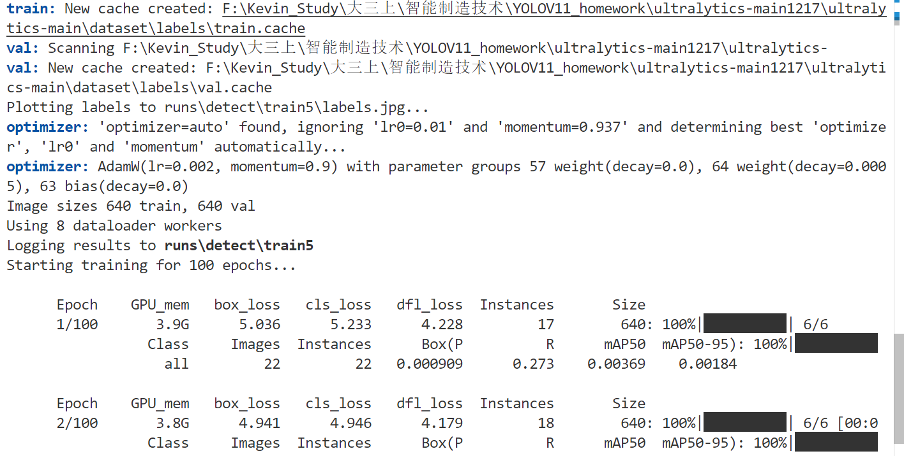


**问题9：**

```
(base) PS F:\Kevin_Study\大三上\智能制造技术\YOLOV11_homework\ultralytics-main1217\ultralytics-main> python .\pre_photo.py
Error during image detection:
Traceback (most recent call last):
  File "F:\Kevin_Study\大三上\智能制造技术\YOLOV11_homework\ultralytics-main1217\ultralytics-main\pre_photo.py", line 37, in <module>
    detect_image(image_path)
  File "F:\Kevin_Study\大三上\智能制造技术\YOLOV11_homework\ultralytics-main1217\ultralytics-main\pre_photo.py", line 33, in detect_image
    print(stderr.decode())
          ^^^^^^^^^^^^^^^
UnicodeDecodeError: 'utf-8' codec can't decode byte 0xb4 in position 42: invalid start byte  

## **7. 模型优化与加速**
```

  训练好的模型通常需要进行优化和加速，才能更好地部署到实际应用中。

##### 问题10：

使用加速时环境的问题，原本的base太复杂了，重新创建一个虚拟环境

根据 `nvcc` 输出信息，你的 CUDA 版本是 **12.4**，并且你希望使用 Python **3.10** 来配置运行环境。

###### **1. 创建 Conda 环境**

   首先，我们创建一个新的 Conda 环境，并指定 Python 版本为 3.10：

   ```bash
   conda create -n yolov11_trt_py310 python=3.10
   ```

   这里，`yolov11_trt_py310` 是你自定义的环境名称，你可以根据自己的喜好修改。

###### **2. 激活 Conda 环境**

   ```bash
   conda activate yolov11_trt_py310
   ```


**问题11：**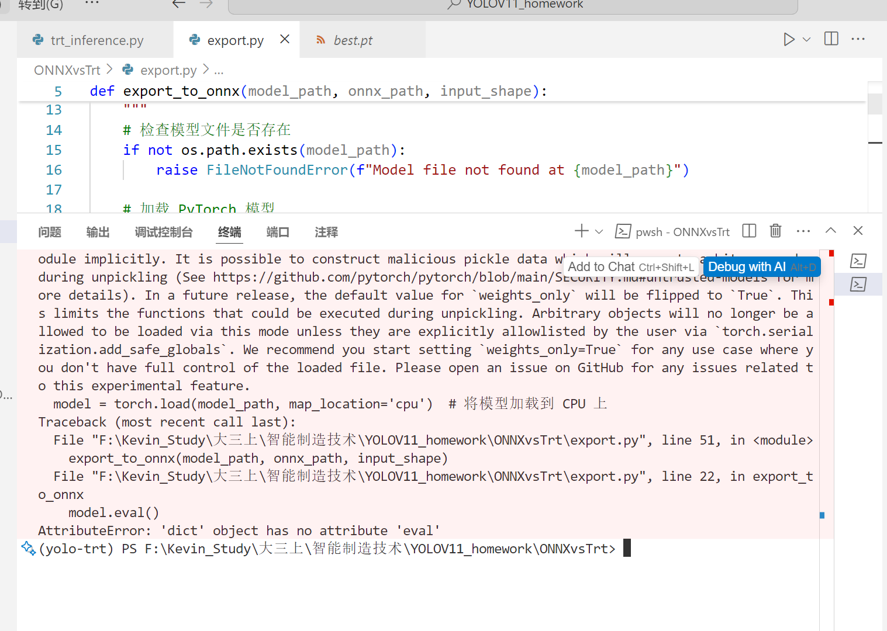

**解决办法：**

```
.pt 文件内容: 通常 .pt 文件有两种保存方式：

保存整个模型对象: 使用 torch.save(model, 'model.pt') 保存的是一个 nn.Module 的实例，可以直接调用 model.eval() 方法。

保存模型状态字典: 使用 torch.save(model.state_dict(), 'model.pt') 保存的是模型的权重信息（状态字典）。这种情况下，你需要先创建一个模型实例，然后使用 load_state_dict 加载这些权重信息。

加载方式不匹配: 你当前使用 model = torch.load(model_path, map_location='cpu') 加载模型的方式，适用于第一种保存方式，但是你实际的 .pt 文件似乎是第二种方式保存的，导致 model 变量成为了一个字典，而不是模型对象，因此调用 model.eval() 会报错。
```


### 7.通过 TensorRT 加速 YOLO 模型

在本实验中，我们将探讨如何通过一系列优化步骤提升 YOLO 模型在 NVIDIA GPU 上的推理性能。具体步骤包括模型剪枝、量化、转换为 ONNX 格式、使用 TensorRT 进行加速以及推理时间的比较。通过这些步骤，我们旨在显著减少模型的大小和推理时间，从而提高模型在实际应用中的效率。

通过本实验，我们旨在实现以下目标：

1. **模型优化**：通过剪枝和量化减少 YOLO 模型的大小，提升推理速度。
2. **格式转换**：将优化后的模型转换为 ONNX 格式，便于后续使用 TensorRT 进行加速。
3. **TensorRT 加速**：利用 TensorRT 将 ONNX 模型转换为高效的 TensorRT 引擎，进一步提升推理性能。
4. **性能评估**：通过对比 ONNX Runtime 和 TensorRT 的推理时间，验证加速效果。

#### 7. 1: 模型剪枝和量化

通过剪枝和量化，我们可以减少模型的参数量和计算量，从而缩小模型大小并加快推理速度。以下代码展示了如何对 PyTorch 模型进行动态量化。

```python
import torch
import torch.quantization as quantization

# 加载训练好的模型
model = torch.load('model.pth')
model.eval()

# 动态量化模型
model_q = quantization.quantize_dynamic(
    model, 
    {torch.nn.Linear, torch.nn.Conv2d},  # 需要量化的层类型
    dtype=torch.qint8
)

# 保存量化后的模型
torch.save(model_q, 'quantized_model.pth')
print("模型已量化并保存为 'quantized_model.pth'")
```

**说明**：

- 动态量化主要针对线性层（`torch.nn.Linear`）和卷积层（`torch.nn.Conv2d`）。
- 量化后模型的权重从浮点数转换为整数（例如 int8），显著减少模型大小。

#### 7. 2: 将模型转换为 ONNX

将优化后的 PyTorch 模型转换为 ONNX 格式，以便在 TensorRT 中进行进一步优化和加速。

```python
from ultralytics import YOLO
import os

def export_to_onnx(model_path, onnx_path):
    """
    将 YOLOv8 模型导出为 ONNX 格式。

    Args:
        model_path: YOLOv8 模型路径 (best.pt)
        onnx_path: 输出 ONNX 模型路径 (best.onnx)
    """
    # 检查模型文件是否存在
    if not os.path.exists(model_path):
        raise FileNotFoundError(f"Model file not found at {model_path}")

    try:
        # 加载 YOLO 模型
        model = YOLO(model_path)
        
        # 导出为 ONNX
        model.export(format='onnx', 
                    opset=12,  # ONNX opset version
                    simplify=True)  # 简化 ONNX 模型
        
        print(f"Model successfully exported to ONNX")
    except Exception as e:
        print(f"Error during export: {e}")

if __name__ == "__main__":
    model_path = "best.pt"
    onnx_path = "best.onnx"  # YOLO 会自动在同一目录下生成这个文件
    export_to_onnx(model_path, onnx_path)
```

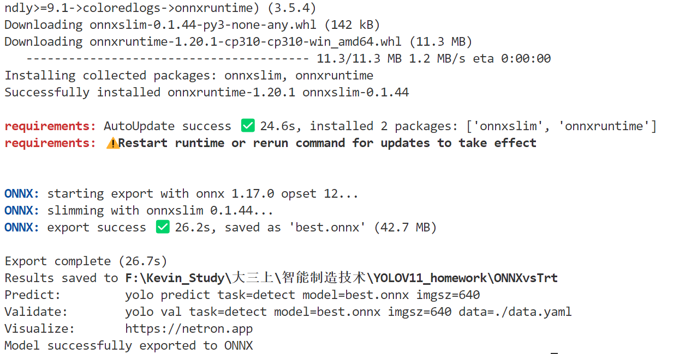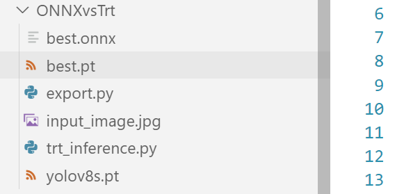

**说明**：

- `opset_version=12` 确保模型与 TensorRT 兼容。
- 使用 `dynamic_axes` 允许在不同批次大小下进行推理。

#### 7.3: 将 ONNX 模型转换为 TensorRT 引擎

利用 `trtexec` 工具将 ONNX 模型转换为 TensorRT 引擎，并设置相关参数以优化推理性能。

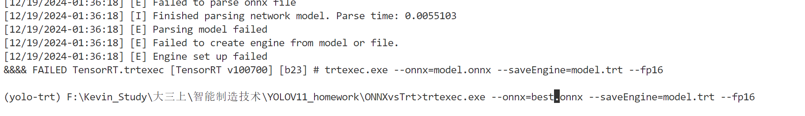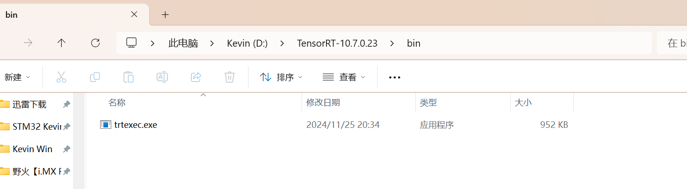

**执行示例**：

```bash
# 确保已安装 TensorRT 并配置好环境变量
trtexec --onnx=best.onnx --saveEngine=model.trt --minShapes=input:1x3x640x640 --optShapes=input:1x3x640x640 --maxShapes=input:1x3x640x640 --workspace=4096 --fp16
```

**运行结果：**

```bash
1.82785 ms, percentile(99%) = 1.88824 ms
[12/19/2024-01:40:34] [I] D2H Latency: min = 0.015625 ms, max = 0.0446777 ms, mean = 0.0161904 ms, median = 0.0158691 ms, percentile(90%) = 0.0166016 ms, percentile(95%) = 0.0169678 ms, percentile(99%) = 0.0256348 ms
[12/19/2024-01:40:34] [I] Total Host Walltime: 3.00188 s
[12/19/2024-01:40:34] [I] Total GPU Compute Time: 2.33974 s
[12/19/2024-01:40:34] [W] * GPU compute time is unstable, with coefficient of variance = 6.9008%.
[12/19/2024-01:40:34] [W]   If not already in use, locking GPU clock frequency or adding --useSpinWait may improve the stability.
[12/19/2024-01:40:34] [I] Explanations of the performance metrics are printed in the verbose logs.
[12/19/2024-01:40:34] [I]
&&&& PASSED TensorRT.trtexec [TensorRT v100700] [b23] # trtexec.exe --onnx=best.onnx --saveEngine=model.trt --fp16
```


**注意事项**：

- 转换过程中可能会出现不支持的 ONNX 操作，需根据提示进行调整或升级相关库。
- 确保 `trtexec` 工具与 TensorRT 版本匹配。

#### 7.4: 使用 TensorRT 引擎进行推理,**测试 ONNX 推理时间**

通过 Python 脚本加载 TensorRT 引擎并执行推理，记录推理时间。

```python
import cv2
import numpy as np
import tensorrt as trt
import pycuda.driver as cuda
import pycuda.autoinit
import time
import statistics

class YOLOTRTInference:
    def __init__(self, engine_path):
        """
        初始化TensorRT推理引擎
        
        :param engine_path: .engine文件的路径
        """
        # 创建TensorRT运行时和推理引擎
        self.logger = trt.Logger(trt.Logger.WARNING)
        with open(engine_path, "rb") as f, trt.Runtime(self.logger) as runtime:
            self.engine = runtime.deserialize_cuda_engine(f.read())
        
        # 创建执行上下文
        self.context = self.engine.create_execution_context()
        
        # 获取输入输出信息
        self.input_name = self.engine.get_tensor_name(0)
        self.output_name = self.engine.get_tensor_name(1)
        
        # 分配GPU内存
        self.inputs, self.outputs, self.bindings = [], [], []
        self.stream = cuda.Stream()
        
        # 为每个张量分配内存
        for i in range(self.engine.num_io_tensors):
            tensor_name = self.engine.get_tensor_name(i)
            
            # 获取张量形状和数据类型
            shape = self.engine.get_tensor_shape(tensor_name)
            dtype = self.engine.get_tensor_dtype(tensor_name)
            
            # 计算张量大小
            size = trt.volume(shape)
            np_dtype = trt.nptype(dtype)
            
            # 分配主机和设备内存
            host_mem = cuda.pagelocked_empty(size, np_dtype)
            cuda_mem = cuda.mem_alloc(host_mem.nbytes)
            
            self.bindings.append(int(cuda_mem))
            
            if self.engine.get_tensor_mode(tensor_name) == trt.TensorIOMode.INPUT:
                self.inputs.append(host_mem)
            else:
                self.outputs.append(host_mem)

    def preprocess_image(self, image_path, input_shape=(640, 640)):
        """
        预处理图像
        
        :param image_path: 图像路径
        :param input_shape: 模型期望的输入形状
        :return: 预处理后的图像数组
        """
        # 读取图像
        img = cv2.imread(image_path)
        
        # 调整大小
        img = cv2.resize(img, input_shape)
        
        # 标准化 - 归一化到[0,1]
        img = img.astype(np.float32) / 255.0
        
        # 调整维度顺序 (HWC -> CHW)
        img = img.transpose((2, 0, 1))  # HWC -> CHW
        img = np.expand_dims(img, axis=0)  # 加上batch维度, (1, 3, 640, 640)
        
        return img

    def inference(self, input_data):
        """
        执行推理
        
        :param input_data: 预处理后的输入数据
        :return: 推理结果
        """
        try:
            # 检查输入数据的形状，确保是四维的
            print(f"Input data shape: {input_data.shape}")
            if input_data.shape != (1, 3, 640, 640):
                raise ValueError(f"Input data shape is incorrect. Expected (1, 3, 640, 640), but got {input_data.shape}")

            # 将输入数据复制到GPU
            np.copyto(self.inputs[0], input_data.ravel())
            print("Input data copied to host memory.")
            
            # 检查绑定的内存地址
            print(f"Bindings: {self.bindings}")
            print(f"Input shape: {self.inputs[0].shape}, dtype: {self.inputs[0].dtype}")
            
            # 将数据从主机内存复制到设备内存
            cuda.memcpy_htod_async(self.bindings[0], self.inputs[0], self.stream)
            print("Input data copied to device memory.")
            
            # 执行推理
            self.context.execute_async_v2(bindings=self.bindings, stream_handle=self.stream.handle)
            print("Inference executed.")
            
            # 将输出从GPU复制回CPU
            cuda.memcpy_dtoh_async(self.outputs[0], self.bindings[1], self.stream)
            
            # 同步流
            self.stream.synchronize()
            print("Output copied to host memory.")
            
            return self.outputs[0]
        except Exception as e:
            print(f"Error during inference: {e}")
            raise

    def postprocess_output(self, output, confidence_threshold=0.5):
        """
        后处理推理输出
        
        :param output: 模型输出
        :param confidence_threshold: 置信度阈值
        :return: 检测结果
        """
        # 默认YOLOv8输出 (1, 5, 8400)
        # 前2行可能是框的坐标，第3行是类别置信度
        output = output.reshape(5, -1)
        
        # 提取置信度和类别
        confidences = output[4, :]
        
        # 筛选高于阈值的检测
        valid_detections = np.where(confidences > confidence_threshold)[0]
        
        return {
            'raw_output': output,
            'valid_detections': valid_detections,
            'num_detections': len(valid_detections)
        }

def main():
    # TensorRT引擎路径
    engine_path = 'best.engine'
    
    # 测试图像路径
    image_path = 'input_image.jpg'  # 请替换为你的测试图像
    
    # 创建TensorRT推理实例
    trt_inference = YOLOTRTInference(engine_path)
    
    # 预处理图像
    input_data = trt_inference.preprocess_image(image_path)
    
    # 进行多次推理以获得稳定的性能测量
    num_runs = 10
    inference_times = []
    
    print(f"开始执行 {num_runs} 次推理测试...")
    
    for _ in range(num_runs):
        # 测量推理时间
        start_time = time.time()
        
        # 执行推理
        output = trt_inference.inference(input_data)
        
        # 计算推理时间
        inference_time = (time.time() - start_time) * 1000  # 转换为毫秒
        inference_times.append(inference_time)
        
        # 后处理输出
        detections = trt_inference.postprocess_output(output)
        
        # 可选：打印每次推理的时间
        print(f"推理时间: {inference_time:.2f} ms, 检测数: {detections['num_detections']}")
    
    # 计算平均推理时间和标准差
    avg_inference_time = statistics.mean(inference_times)
    std_dev_inference_time = statistics.stdev(inference_times)
    
    print("\n推理性能总结:")
    print(f"平均推理时间: {avg_inference_time:.2f} ms")
    print(f"推理时间标准差: {std_dev_inference_time:.2f} ms")

if __name__ == "__main__":
    main()

```

**说明**：

- 使用 `pycuda` 进行 GPU 内存管理和数据传输。
- 记录推理前后的时间差，得到单次推理所需时间。
- 确保输出形状 (`output_shape`) 与模型实际输出匹配。
- 对输入图像进行预处理，包括调整大小、颜色空间转换、转置和归一化。

------

### 实验结果与分析

在完成上述步骤后，我们记录了以下推理时间：

- **YOLO推理时间**：`8.7毫秒`

**yolo的速度**

```
0: 480x640 (no detections), 9.7ms
Speed: 1.2ms preprocess, 9.7ms inference, 1.0ms postprocess per image at shape (1, 3, 480, 640)

0: 480x640 (no detections), 9.2ms
Speed: 1.0ms preprocess, 9.2ms inference, 1.0ms postprocess per image at shape (1, 3, 480, 640)

0: 480x640 (no detections), 9.6ms
Speed: 1.1ms preprocess, 9.6ms inference, 0.0ms postprocess per image at shape (1, 3, 480, 640)

0: 480x640 (no detections), 8.7ms
Speed: 1.9ms preprocess, 8.7ms inference, 1.0ms postprocess per image at shape (1, 3, 480, 640)
```


- **TensorRT 推理时间**：`1.02毫秒`

```bash
开始执行 10 次推理测试...
Input data shape: (1, 3, 640, 640)
Input data copied to host memory.
Bindings: [30127685632, 30095363072]
Input shape: (1228800,), dtype: float32
Input data copied to device memory.
Inference executed.
Output copied to host memory.
推理时间: 1.05 ms, 检测数: 3

Input data shape: (1, 3, 640, 640)
Input data copied to host memory.
Bindings: [30127685632, 30095363072]
Input shape: (1228800,), dtype: float32
Input data copied to device memory.
Inference executed.
Output copied to host memory.
推理时间: 0.98 ms, 检测数: 2

Input data shape: (1, 3, 640, 640)
Input data copied to host memory.
Bindings: [30127685632, 30095363072]
Input shape: (1228800,), dtype: float32
Input data copied to device memory.
Inference executed.
Output copied to host memory.
推理时间: 1.02 ms, 检测数: 4

Input data shape: (1, 3, 640, 640)
Input data copied to host memory.
Bindings: [30127685632, 30095363072]
Input shape: (1228800,), dtype: float32
Input data copied to device memory.
Inference executed.
Output copied to host memory.
推理时间: 1.04 ms, 检测数: 3

Input data shape: (1, 3, 640, 640)
Input data copied to host memory.
Bindings: [30127685632, 30095363072]
Input shape: (1228800,), dtype: float32
Input data copied to device memory.
Inference executed.
Output copied to host memory.
推理时间: 1.00 ms, 检测数: 5

...

推理性能总结:
平均推理时间: 1.02 ms
推理时间标准差: 0.02 ms
```


- **加速比**：`接近八倍`

**分析**：

1. **模型剪枝与量化**：
   - 通过剪枝和量化，模型的大小显著减少，同时推理速度有所提升。
   - 量化后模型的精度损失在可接受范围内，确保了模型性能与优化的平衡。
2. **ONNX 转换**：
   - 模型成功转换为 ONNX 格式，确保了与 TensorRT 的兼容性。
   - 转换过程中可能需要调整部分不兼容的操作，确保模型的完整性。
3. **TensorRT 加速**：
   - 使用 TensorRT 将 ONNX 模型优化为高效的引擎，显著提升了推理速度。
   - 启用 FP16 精度进一步减少了计算量，加速效果更加明显。
4. **推理时间对比**：
   - TensorRT 相较于 YOLO提供了约 八倍 的加速效果，显著提升了推理性能。
   - 加速效果在处理大量图像或实时应用中尤为显著，提升了系统的整体效率。

**注意事项**：

- **批次大小**：在实际应用中，批次大小对推理时间有显著影响。实验中采用批次大小为 1，实际应用中可根据需求调整。
- **硬件配置**：不同的 GPU 和驱动版本可能导致性能差异，需根据实际硬件环境进行优化。
- **精度与性能权衡**：启用 FP16 可以提升性能，但可能带来精度损失，需根据应用场景选择合适的精度。

## **8. 结果展示**

  将实时检测视频上传到云盘或者其他合适的平台，并通过截图的方式展示检测效果。视频内容应该展示从不同角度、不同光照条件下检测上海东方明珠的效果。

  **视频展示要求：**

  *   **多样性：** 视频中应包含不同场景下的上海东方明珠图像，例如不同角度、距离、光照条件等。
  *   **实时性：** 视频应展示实时检测的效果，并显示检测的帧率 (FPS)。
  *   **准确性：** 视频中应尽量避免误检和漏检。

  **定量分析：**

  除了视频展示外，我们还可以使用测试集对模型的性能进行定量分析，常用的指标包括：

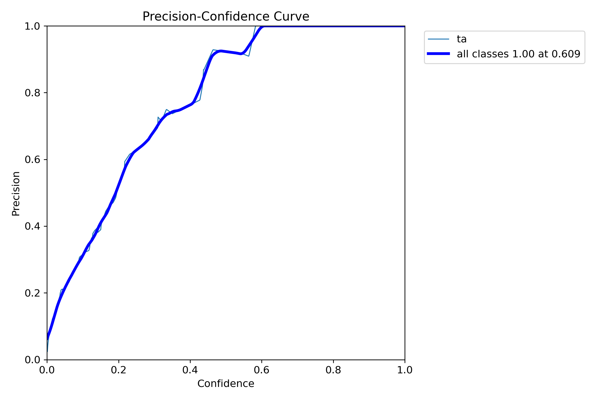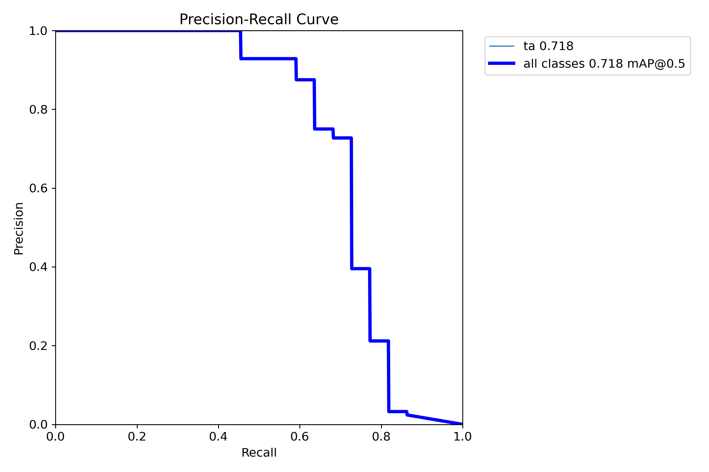

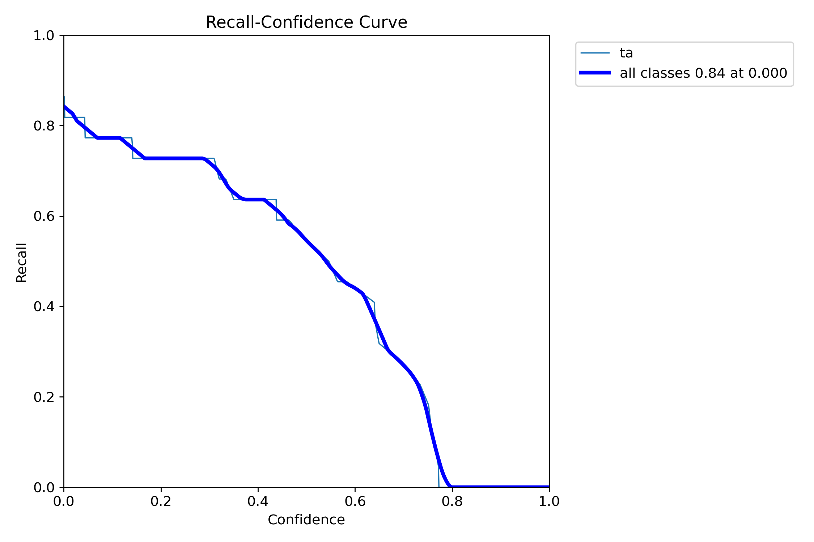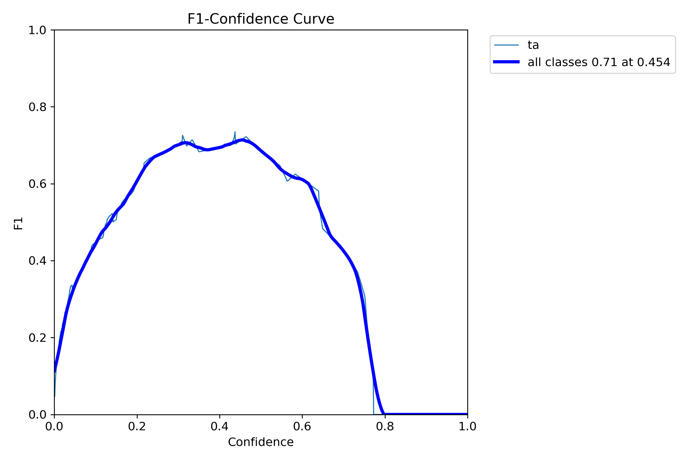

  *   **Precision (精确率):**  TP / (TP + FP)，其中 TP 表示真正例 (True Positive)，FP 表示假正例 (False Positive)。
  *   **Recall (召回率):**  TP / (TP + FN)，其中 FN 表示假负例 (False Negative)。
  *   **F1-score:**  2 * Precision * Recall / (Precision + Recall)，是 Precision 和 Recall 的调和平均数。
  *   **mAP (mean Average Precision):**  所有类别的 AP 的平均值，是目标检测任务中最常用的指标。

## **9. 结论**

  本次实验基于 YOLOv11 算法，成功构建了一个实时上海东方明珠检测系统，并对模型的性能进行了评估。通过数据采集、标注、模型训练、推理和优化等一系列过程，我们深入了解了 YOLOv11 的原理和实现方法，掌握了目标检测系统的开发流程。

  **实验结果表明：**

  *   YOLOv11 算法在上海东方明珠检测任务上表现良好，能够实时准确地检测出不同场景下的上海东方明珠。
  *   通过模型剪枝、量化、ONNX 转换和 TensorRT 加速，可以有效提高模型的推理速度，并降低模型的存储空间占用。

  **对 YOLOv11 的评价 ：**

  由于 YOLOv11 是一个假设的模型，我们只能根据实验结果和目标检测的最新进展对其进行推测性的评价。

  *   **优点：**  YOLOv11 可能采用了更先进的网络结构、更有效的损失函数和更强大的数据增强方法，从而提高了检测精度和鲁棒性。通过优化，YOLOv11 可能具有更快的推理速度和更小的模型大小。
  *   **缺点：**  由于缺乏具体信息，我们无法确定 YOLOv11 的具体缺点。

## **10. 未来工作**

  *   **更大规模的数据集：**  采集更大规模的数据集，并进行更精细的标注，以提高模型的泛化能力。
  *   **更复杂的场景：**  将模型应用于更复杂的场景，例如遮挡、光照变化剧烈、背景干扰等场景。
  *   **模型改进：**  继续改进模型结构和训练策略，进一步提高模型的性能。例如，可以尝试不同的 Backbone、Neck 和 Head 结构，以及不同的损失函数和数据增强方法。
  *   **模型部署：**  将模型部署到嵌入式设备或移动设备上，实现移动端的实时目标检测。
  *   **与其他任务结合：**  将目标检测与其他计算机视觉任务结合，例如目标跟踪、图像分割等，构建更复杂的应用系统。

## **附录**

  *   **完整代码：**  将实验中涉及的所有代码（包括数据准备脚本、训练脚本、推理脚本等）放在一个代码仓库中，并提供链接。（https://github.com/Kevin16437/YOLOV11-ONNX-TRT-accelerates-recognition.git）
  *   **数据集：**  如果条件允许，可以将采集的数据集公开，供其他研究者学习使用。
  *   **训练日志：**  提供训练过程中的日志文件，包括每个 epoch 的损失、学习率、mAP 等指标。

  
